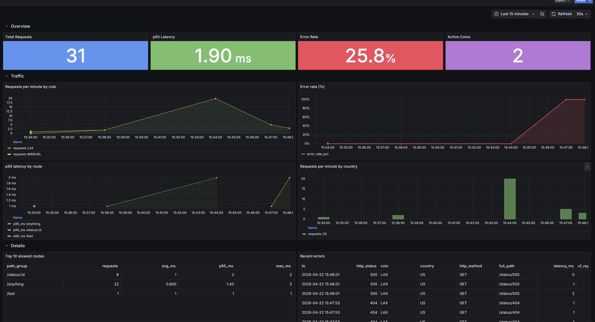

# Cloudflare Workers + GreptimeDB

A demo using GreptimeDB as Cloudflare Workers' **event / log / time-series
store** — the gap D1 (SQLite) and Analytics Engine (lossy, rigid
cardinality) don't fill.

- **Writes** — InfluxDB v2 `Point` builder + raw `fetch` →
  GreptimeDB's line-protocol endpoint. Stateless, pure fetch, no TCP.
- **Reads** — [Hyperdrive][hyperdrive] + [`postgres.js`][pg-js] →
  GreptimeDB's PG wire. The CF-native pattern that matches the other
  providers on CF's [third-party database integrations page][cf-third-party].

[hyperdrive]: https://developers.cloudflare.com/hyperdrive/
[pg-js]: https://github.com/porsager/postgres
[cf-third-party]: https://developers.cloudflare.com/workers/databases/third-party-integrations/

## Architecture

```
                    +-----------------------------------------------+
                    |  docker-compose stack                         |
                    |                                               |
  +--------+        |  +-------------+                              |
  | client |-------->--| Worker      |  (reverse proxy +            |
  |        |<--------<-| :8787       |   event logger)              |
  +--------+        |  +--+--------+-+                              |
                    |     | write  ^ read                           |
                    |     v  path  | path                           |
                    |  +-----------+----------+   +--------------+  |
                    |  | GreptimeDB           |<--| Grafana      |  |
                    |  |  :4000 HTTP/InfluxDB |   |   :3000      |  |
                    |  |  :4003 pg wire       |   | (mysql proto)|  |
                    |  +----------------------+   +--------------+  |
                    +-----------------------------------------------+
```

Everything runs via `docker compose` — no host-side Node or wrangler
required for the demo itself.

## Quick Start

```bash
cd cloudflare-workers
docker compose up -d
```

Five services: `greptimedb` (HTTP :4000, pg wire :4003, MySQL :4002),
`init-schema` (applies [`schema.sql`](schema.sql) then exits), `origin`
(local httpbin clone used as the Worker's proxy target), `worker` (Worker
under `wrangler dev`, :8787), `grafana` (:3000).

Generate traffic and query it back:

```bash
curl http://localhost:8787/anything
curl http://localhost:8787/status/404
for i in {1..50}; do curl -s http://localhost:8787/anything?i=$i > /dev/null; done

# read path — Worker -> Hyperdrive -> GreptimeDB pg wire
curl "http://localhost:8787/_stats?window=5" | jq

# direct to GreptimeDB
curl -s "http://localhost:4000/v1/sql?db=public" \
  --data-urlencode "sql=SELECT count(*) FROM worker_events"
```

Open Grafana: http://localhost:3000 (anonymous viewer). The **Edge Traffic
(CF Workers → GreptimeDB)** dashboard is pre-provisioned:



## Iterating on Worker code

```bash
docker compose up -d --build worker
docker compose logs -f worker
```

Faster edit-loop on host (needs Node):
[`worker/README.md`](worker/README.md#running-on-the-host-escape-hatch).

## How it works

### Write path — `Point` builder + raw fetch

The Worker uses `@influxdata/influxdb-client-browser`'s `Point` for
line-protocol formatting, then POSTs via `fetch`. It **does not** use the
SDK's `WriteApi` — that silently drops writes in Workers (see
[influxdb-client-js#170](https://github.com/influxdata/influxdb-client-js/issues/170)).
Full write path in [`worker/src/index.ts`](worker/src/index.ts).

GreptimeDB's InfluxDB v2 endpoint:
- `POST /v1/influxdb/api/v2/write?org=<any>&bucket=<db>&precision=ns`
- Auth: `Authorization: token <username>:<password>` when secured

### Read path — Hyperdrive + postgres.js

Three knobs worth knowing (see [`worker/src/index.ts`](worker/src/index.ts)):

- `prepare: false` — forces simple-query mode. GreptimeDB's extended-query
  path rejects postgres.js type OIDs with `unknown_parameter_type`.
- `fetch_types: false` — skips the `pg_type` bootstrap; GreptimeDB's
  `pg_type` coverage is thin.
- `max: 5` — CF-recommended per-Worker cap.

### Path cardinality

High-cardinality path segments (IDs, UUIDs) as tags explode the primary
key. `normalizePathGroup()` collapses them:

```
/api/users/42                                  -> /api/users/:id
/objects/550e8400-e29b-41d4-a716-446655440000  -> /objects/:uuid
```

In production, replace the ad-hoc regex with your router's pattern matcher.

## Example queries

[`queries.sql`](queries.sql) has seven canonical queries (per-minute QPS
by colo, p50/p95/p99 by route, error rate, top slow endpoints, traffic by
country, colo distribution, recent errors).

> HTTP SQL and PG wire use **double quotes** for identifiers. The Grafana
> MySQL datasource uses **backticks**. Don't mix — mismatched quoting
> returns empty results silently.

## Production considerations

- **Batching** — 1 write per request handles low-thousands RPS. At scale,
  route events through a [Cloudflare Queue][queues] and batch-write from
  a consumer.
- **Sampling** — keep all errors, sample 2xx aggressively.
- **TTL / partitioning** — [`schema.sql`](schema.sql) sets `ttl = '30d'`.
  For high volume add time partitioning per
  [GreptimeDB docs][gdb-partition].
- **Why not `@greptime/ingester`?** The official TS ingester uses
  `@grpc/grpc-js` (Node-only); it can't run in Workers today. A
  fetch-based `@greptime/ingester-web` is on the SDK's roadmap and would
  be the natural long-term replacement for this demo's raw-fetch write.

[queues]: https://developers.cloudflare.com/queues/
[gdb-partition]: https://docs.greptime.com/user-guide/deployments-administration/manage-data/table-sharding

## Deploy to Cloudflare's real edge

Beyond local `docker compose`, to run the Worker on Cloudflare's actual
edge and point it at your own GreptimeDB — see [**DEPLOY.md**](DEPLOY.md).
Covers the quick smoke-test (writes only, `trycloudflare` quick tunnel)
and the full production setup (writes + Hyperdrive reads, named tunnel).

## Appendix: getting listed on `developers.cloudflare.com`

1. Ship this demo — reference implementation, done.
2. Publish a getting-started guide on greptime.com with a stable URL.
3. PR to [`cloudflare/cloudflare-docs`](https://github.com/cloudflare/cloudflare-docs)
   adding a page under `src/content/docs/workers/databases/third-party-integrations/`.
4. DevRel outreach via [CF's Developer Discord](https://discord.cloudflare.com/)
   — review cycles are faster with a champion.

## Cleanup

```bash
docker compose down -v
```
