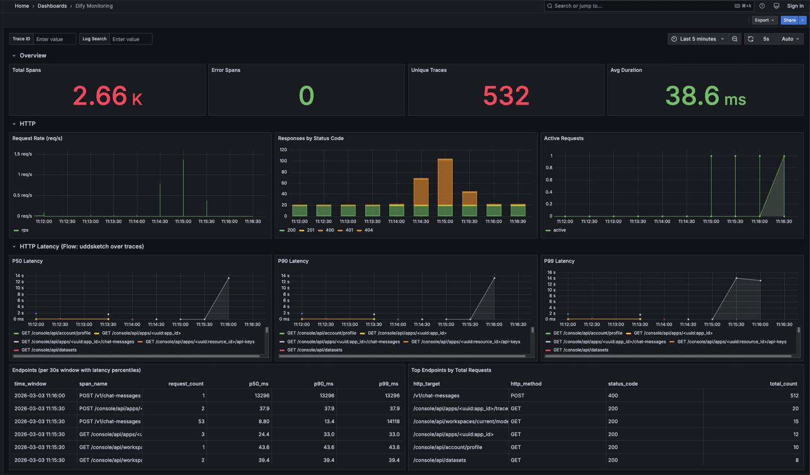
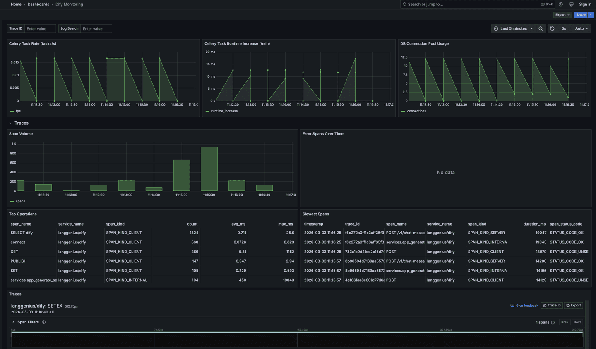
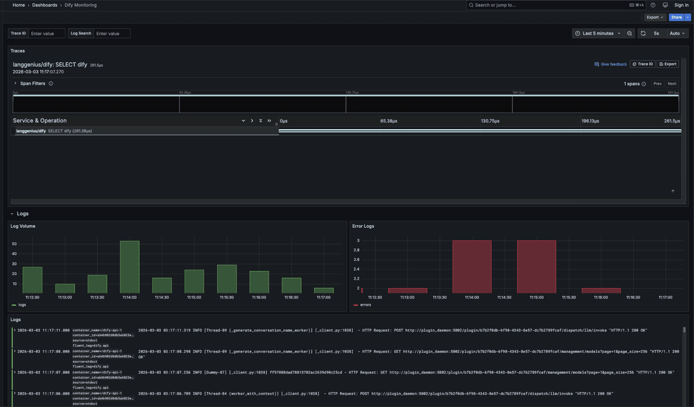

# Dify Monitoring with GreptimeDB

Monitor [Dify](https://github.com/langgenius/dify) using OpenTelemetry and [GreptimeDB](https://github.com/GreptimeTeam/greptimedb).

## Architecture

```
┌──────────────────────────────────────────────────────┐
│  Dify Stack                                          │
│  ┌─────┐ ┌────────┐ ┌─────┐ ┌───────┐               │
│  │ api │ │ worker │ │ web │ │ nginx │ :80           │
│  └──┬──┘ └───┬────┘ └─────┘ └───┬───┘               │
│     │ OTLP   │ OTLP     fluentd │ fluentd           │
└─────┼────────┼──────────────────┼────────────────────┘
      │        │                  │  network: dify-monitoring
┌─────▼────────▼──────────────────▼────────────────────┐
│  Monitoring Stack                                    │
│  ┌──────────────────┐  ┌────────────┐  ┌─────────┐  │
│  │  OTel Collector   │  │ GreptimeDB │  │ Grafana │  │
│  │ :4318 OTLP       │─▶│   :4000    │◀─│  :3000  │  │
│  │ :24224 fluentd   │  └────────────┘  └─────────┘  │
│  └──────────────────┘                                │
└──────────────────────────────────────────────────────┘
```

## Data Sources

**Traces & Metrics** — Dify's built-in OpenTelemetry instrumentation (OTLP push):

- Flask HTTP requests (latency, status codes, routes)
- Celery async task execution
- SQLAlchemy database queries
- Redis cache operations
- HTTPX outbound HTTP calls (including LLM API calls)

**Logs** — Docker fluentd logging driver → OTel Collector fluentforward receiver:

- `api` container logs (tag: `dify.api`)
- `worker` container logs (tag: `dify.worker`)
- `nginx` container logs (tag: `dify.nginx`)

## Quick Start

```bash
./setup.sh
```

This will:

1. Download Dify v1.13.0 docker files
2. Enable OpenTelemetry in Dify's configuration
3. Start all services (Dify + GreptimeDB + OTel Collector + Grafana) using `docker-compose.yml`
4. Initialize Flow aggregations in background (waits for `opentelemetry_traces` table, then creates flows)

## Access

| Service              | URL                              |
|----------------------|----------------------------------|
| Dify UI              | http://localhost                  |
| Grafana              | http://localhost:3000 (admin/admin) |
| GreptimeDB Dashboard | http://localhost:4000/dashboard   |
| GreptimeDB MySQL     | `mysql -h 127.0.0.1 -P 4002` |

## Dashboard

The Grafana dashboard (`Dify Monitoring`) has six row sections: Overview, HTTP, HTTP Latency (Flow uddsketch), Celery & Database, Traces, and Logs. The Traces section includes a waterfall view via the [GreptimeDB Grafana plugin](https://github.com/GreptimeTeam/greptimedb-grafana-datasource).

Two dashboard variables are available in the top bar:

- **Trace ID** — filter all trace panels by a specific trace. When empty, the waterfall shows the most recent trace.
- **Log Search** — fuzzy search log body (`LIKE %keyword%`).







## Flow: Trace-Derived Metrics

`setup.sh` automatically initializes flows in the background. If you need to re-create them manually:

```bash
# optional: increase wait timeout (seconds), default is 600
WAIT_TIMEOUT_SECONDS=1200 ./init-flow.sh
```

This creates two [GreptimeDB Flow](https://docs.greptime.com/user-guide/flow-computation/overview/) aggregations that continuously compute RED metrics from raw spans:

| Flow | Sink Table | Description |
|------|-----------|-------------|
| `trace_http_latency_flow` | `trace_http_latency_30s` | HTTP P50/P90/P99 latency via [uddsketch](https://docs.greptime.com/user-guide/traces/extend-trace/) |
| `trace_operation_throughput_flow` | `trace_operation_throughput_30s` | Operation throughput by span kind |

See [`init-flow.sh`](init-flow.sh) for the full CREATE FLOW SQL. You can inspect active flows with `SHOW FLOWS`.

Query example — P90 latency per endpoint:

```sql
SELECT span_name,
       uddsketch_calc(0.90, duration_sketch) / 1000000 AS p90_ms
FROM trace_http_latency_30s
ORDER BY time_window DESC
LIMIT 10;
```

## Explore Data

After Dify starts processing requests, connect to GreptimeDB and explore:

```sql
SHOW TABLES;

-- View recent trace spans
SELECT timestamp, trace_id, span_name, service_name,
       duration_nano / 1000000 AS duration_ms, span_status_code
FROM opentelemetry_traces
ORDER BY timestamp DESC
LIMIT 20;

-- View recent logs
SELECT timestamp, body, scope_name
FROM dify_logs
ORDER BY timestamp DESC
LIMIT 20;
```

## Load Generator (Optional)

Generate synthetic traffic to produce telemetry data:

```bash
# Set your Dify API key first
export DIFY_API_KEY="app-xxxx"

docker compose run --rm load-generator
```

## Teardown

```bash
./teardown.sh

# or remove containers + volumes
./teardown.sh -v
```

## Configuration

### Dify OTEL Settings

These are set automatically by `setup.sh` in `dify/.env`:

| Variable                      | Value                          | Description                  |
|-------------------------------|--------------------------------|------------------------------|
| `ENABLE_OTEL`                 | `true`                         | Enable OpenTelemetry         |
| `OTLP_BASE_ENDPOINT`          | `http://otel-collector:4318`   | Collector HTTP endpoint      |
| `OTEL_SAMPLING_RATE`          | `1.0`                          | 100% sampling for demo       |
| `OTEL_METRIC_EXPORT_INTERVAL` | `15000`                        | Export metrics every 15s     |

### Log Collection

Container logs (`api`, `worker`, `nginx`) are forwarded to the OTel Collector via Docker's [fluentd logging driver](https://docs.docker.com/config/containers/logging/fluentd/) and stored in the `dify_logs` table. See `docker-compose.yml`.

### Dify Version

```bash
DIFY_VERSION=1.13.0 ./setup.sh
```

## Known Limitations

- Dify's OTEL integration exports traces and metrics only — log collection uses Docker's fluentd logging driver as a workaround.
- LLM prompt/completion spans are not included — only infrastructure-level traces (HTTP, DB, Redis, Celery).
- Dashboard queries assume the default GreptimeDB OTLP table schema. Run `SHOW TABLES` and adjust if table names differ.
- Fluentd-collected logs have second-precision timestamps and no trace context. Container metadata (`container_name`, `source`) is extracted from `log_attributes` JSON.
- The trace waterfall view shows one trace at a time (plugin limitation). Use the Trace ID filter or copy a trace ID from the Slowest Spans table.
