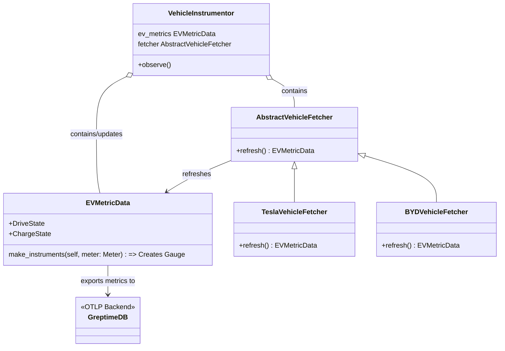

# Tesla OpenTelemetry Metric Capture

This project demonstrates capturing Tesla charging and
driving metrics with OpenTelemetry and Python in GreptimeDB.
 
## How to run this demo

Ensure you have installed `git`, `docker`, `docker-compose` 

You also must have a valid Tesla Login with a registered vehicle.
This project uses [TeslaPy](https://github.com/tdorssers/TeslaPy) 
which leverages the Tesla Owner API to gather the vehicle metrics.

To run this demo:

**Start the Docker Network**

This command builds the containers and 
waits for the app container to start up.

```shell
TESLA_USER_EMAIL=<Your Tesla Email> docker-compose up -d && \
while [ "$(docker inspect -f '{{.State.Running}}' ev-open-telemetry_ev_observer_1)" != "true" ]; do
  echo "Waiting for container ev-open-telemetry_ev_observer_1 to be up..."
  sleep 1
done && docker attach ev-open-telemetry_ev_observer_1
```

**Authenticate to Tesla**

When the container is running, you will see the string 

`Open this URL to authenticate: https://auth.tesla.com/oauth2/v3/authorize?...`

Follow this URL in your browser window and login 
with your Tesla credentials.  Upon successful authentication, 
you will be redirected to a blank page. 
Copy and paste the url from your browser 
into your terminal, which will use the token to authenticate for you.
After you complete this process once, the `cache.json` file will be able to 
use the refresh token to keep the authenticated session active.


## How it works
This project uses the standard OpenTelemetry SDK to capture metrics
and export them to the OTLP-compatible, GreptimeDB back end. 
The configuration of the Metric Provider, Meter, Reader, and Exporter is all done in the [__init__.py](./ev_observer/ev_observer/__init__.py) file of the main package. 

After the meter is created, all instruments created with that meter
will be read and exported as configured in the provider.

Generating and refreshing the metrics relies on the `VehicleInstrumentor` which holds a reference to an `EVMetricData` class.

this `EVMetricData` has `MetricCollector` properties, that essentially act as watchers of the superclasses properties, and exports them from the configured provider. The `EVMetricData` is refreshed using the configured `fetcher`.

The `VehicleInstrumentor` can be configured with any `AbstractVehicleDataFetcher` which supports extending this collection process to other EVs in the future.

An overview of the components involved in the collection process is summarized
in the class diagram


## Future Development
**To add additional metrics to our collection**
1. Create a new class that sub-classes the `MetricCollector` 
2. Add a property to the `VehicleInstrumentor` that contains a reference to this new collector
3. Update the `AbstractVehicleDataFetcher` implementation to return this new MetricCollector data

**To add new collection process with different vehicles**

implement a new `AbstractVehicleDataFetcher` and then configure the `VehicleInstrumentor` to utilize this fetcher