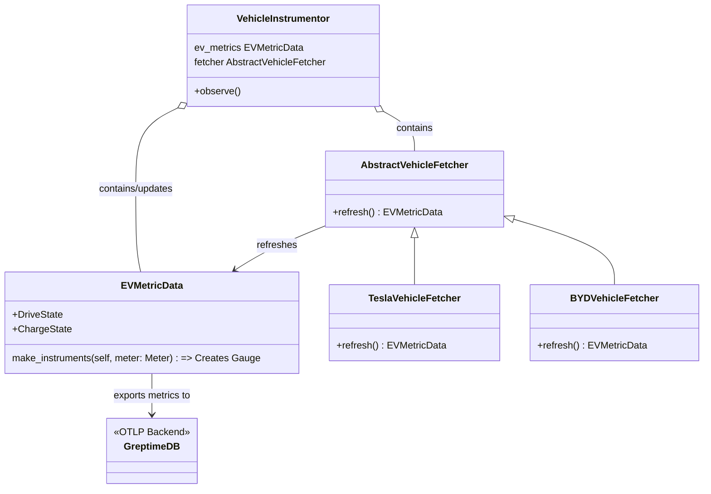

# Tesla OpenTelemetry Metric Capture

This project demonstrates capturing Tesla charging and
driving metrics with OpenTelemetry and Python in GreptimeDB.
 
## How to run this demo

Ensure you have `git`, `docker`, `docker-compose` `python` and `poetry`
installed. 

You also must have a valid Tesla Login with a registered vehicle.
This project uses [TeslaPy](https://github.com/tdorssers/TeslaPy) 
which leverages the Tesla Owner API to gather the vehicle metrics.


To run this demo:

**Step 1: Download the cache.json file which requires you to log in to your Tesla account through your browser**

```shell
git clone https://github.com/GreptimeTeam/demo-scene.git
cd demo-scene/ev-open-telemetry/ev_observer && poetry install
TESLA_USER_EMAIL={your_tesla_email} poetry run python main.py
```

After this point a browser window will open up in order for you to login 
with your Tesla credentials.  Upon successful authentication, 
you will be redirected to a blank page. you must copy and paste the url in your browser 
into your terminal which will save the cache file to authenticate for you.
After you complete this process once, the cache.json file will be able to 
use the refresh token to keep the authenticated session active.

use `ctr+c` to close the process and run your docker-compose network

**Step 2: Run Docket Network**

This starts the Greptimedb service, Grafana, and Tesla  metric collection process

```sh
TESLA_USER_EMAIL={your_email_info} docker compose up
```


## How it works
This project uses the standard OpenTelemetry SDK to capture metrics
and export them to the OTLP-compatible, GreptimeDB back end. 
The configuration of the Metric Provider, Meter, Reader, and Exporter is all done in the [__init__.py](./ev_observer/ev_observer/__init__.py) file of the main package. 

After the meter is created, all instruments created with that meter
will be read and exported as configured in the provider.

Generating and refreshing the metrics relies on the `VehicleInstrumentor` which holds a reference to an `EVMetricData` class.

this `EVMetricData` has `MetricCollector` properties, that essentially act as watchers of the superclasses properties, and exports them from the configured provider. The `EVMetricData` is refreshed using the configured `fetcher`.

The `VehicleInstrumentor` can be configured with any `AbstractVehicleDataFetcher` which supports extending this collection process to other EVs in the future.

An overview of the components involved in the collection process is summarized
in the class diagram


## Future Development
**To add additional metrics to our collection**
1. create a new class that sub-classes the `MetricCollector` 

2. Add a property to the `VehicleInstrumentor` that contains a reference to this new collector

3. Update the `MetricFetcher` to 

**To add new collection process with different vehicles**

implement a new `AbstractVehicleDataFetcher` and then configure the `VehicleInstrumentor` to utilize this fetcher