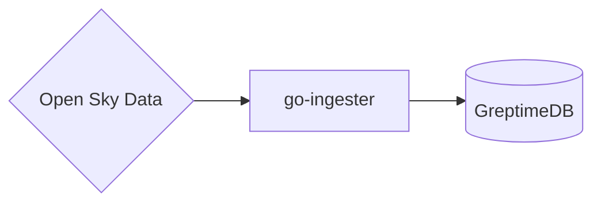

# GreptimeDB Flight

This project demos ingesting open sky data to simulate geo-spatial data ingestion

utilizes the `greptimedb-ingester-go` client to fetch data from the [OpenSky Network API](https://opensky-network.org/apidoc/) and insert into GreptimeDB

## How to run this demo

Ensure you have `git`, `docker`, `docker-compose`
installed. To run this demo:

```shell
git clone https://github.com/GreptimeTeam/demo-scene.git
cd demo-scene/kafka-ingestion
docker compose up
```

It can take a while for the first run to pull down images and also build necessary components.

## How it works

The topology is illustrated in this diagram.



after GreptimeDB starts, we use the `ingester` script which uses the go client's [high level api](https://docs.greptime.com/user-guide/ingest-data/for-iot/grpc-sdks/go/#installation) to create the table and insert data. It's dead-simple to perform transformations and data munging on your struct and insert into target GreptimeDB columns by tagging your metric struct accordingly.

## Note

If you are going to restart this demo, press `Ctrl-C` and remember to call
`docker compose down` to clean up the data before you run `docker compose up`
again.
