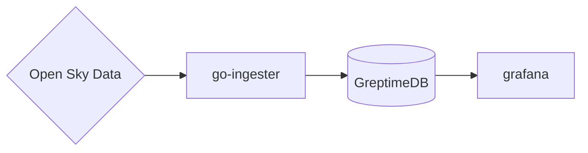

# GreptimeDB Flight

This project demonstrates GreptimeDB's ability to ingest geo-spatial data using the
`greptimedb-ingester-go` client. It selects the last 10 flights that departed in
the last 30 minutes from the configured icao airport code. The ingester script
utilizes the [OpenSky Network API](https://opensky-network.org/apidoc/) to fetch
flight state data and inserts the flight metrics into GreptimeDB


## How to run this demo

Ensure you have `git`, `docker`, `docker-compose`
installed. To run this demo:

```shell
git clone https://github.com/GreptimeTeam/demo-scene.git
cd demo-scene/flight-data-ingester
docker compose up
```

It can take a while for the first run to pull down images and also build
necessary components.

Open your browser at `http://localhost:3000` and find our preconfigured grafnaa
dashboard. The default user/pw is admin/admin

## How it works

The topology is illustrated in this diagram.



after GreptimeDB starts, we use the `ingester` script which uses the go client's
[high level api](https://docs.greptime.com/user-guide/ingest-data/for-iot/grpc-sdks/go/#installation)
to create the table and insert data. It's dead-simple to perform transformations and data munging for insertion into target GretimeDB tables.
Create and tag your metric struct accordingly as seen in the `./ingester/dto.go` file.

## Note

please update the ICAO flight code for your local airport of the city you are
running the demo in to ensure there is data in the set. This can be done by
setting the `ICAO_AIRPORT_CODE` environment variable when running `docker
compose up`.

The anonymous user can only make 400 requests per day.
Set the `OPENSKY_USERNAME` and `OPENSKY_PASSWORD` env variables with
your credentials to use basic authentication in the open sky requests for higher limits.

If you are going to restart this demo, press `Ctrl-C` and remember to call
`docker compose down` to clean up the data before you run `docker compose up`
again.
