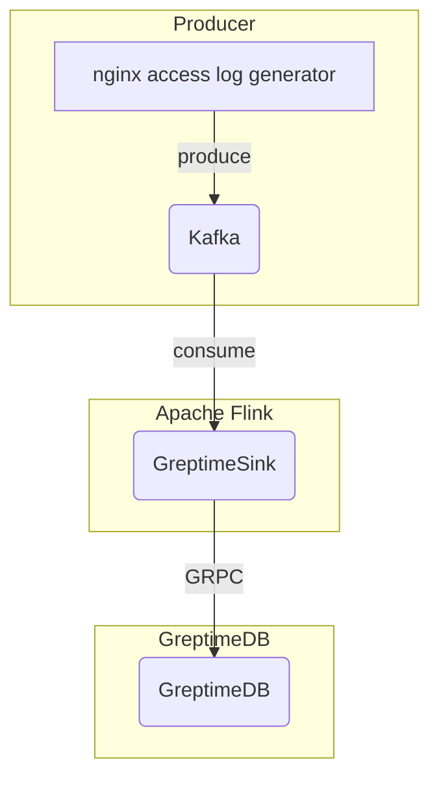

# Apache Flink + GreptimeDB Ingestion Demo

## Introduction

This project demonstrates a real-time data ingestion pipeline using Apache Flink for GreptimeDB. It simulates the
process of collecting Nginx access logs, processing them with Apache Flink, and storing them in GreptimeDB for further
analysis. We have also opensourced the code for the Apache Flink job, which you can find in
the [flink-demo](https://github.com/GreptimeTeam/flink-demo) repository.

## Architecture

The following diagram illustrates the architecture of this demo:



The core part of this demo is the `GreptimeSink`, which is a custom Apache Flink sink implementation that inserts data
into GreptimeDB through a high-performance gRPC interface. We call it "bulk insert" feature in GreptimeDB, a very
efficient way to ingest large volume of data into GreptimeDB, since its version v0.15.

## How to Use

1. **Start the demo:**

   > First please make sure you have ports `4000` ~ `4003` and `8081` available on your machine, as they will be used
   > (exposed) by GreptimeDB and Apache Flink in this docker-compose.

   ```bash
   docker compose up
   ```

2. **Check the data in GreptimeDB:**

   You can use any PostgreSQL client or MySQL client to connect to GreptimeDB and query the data. The connection details
   are:

    - **Host**: `127.0.0.1`
    - **Port**: `4003` (for PostgreSQL) or `4002` (for MySQL)
    - **Database**: `public`

   By querying the `nginx_access_log` table in GreptimeDB, you can see the ingested data: the structured Nginx access
   logs. For example, you can run the following SQL to see the latest 10 logs:

      ```text
   mysql> SELECT * FROM nginx_access_log ORDER BY access_time DESC LIMIT 10;
   +---------------------+-----------------+--------+----------+----------+--------+------+------------------------------------------------------------------------------------------------------------------------------------------------------+
   | access_time         | client          | method | uri      | protocol | status | size | agent                                                                                                                                                |
   +---------------------+-----------------+--------+----------+----------+--------+------+------------------------------------------------------------------------------------------------------------------------------------------------------+
   | 2025-06-26 07:58:54 | 116.22.183.249  | DELETE | /post    | HTTP/2.0 |    200 |  528 | Mozilla/5.0 (iPhone; U; CPU iPhone OS 4_3_3 like Mac OS X; en-us) AppleWebKit/533.17.9 (KHTML, like Gecko) Version/5.0.2 Mobile/8J2 Safari/6533.18.5 |
   | 2025-06-26 07:58:54 | 247.71.1.63     | GET    | /        | HTTP/2.0 |    500 |  225 | Opera/9.80 (Android 2.3.4; Linux; Opera Mobi/build-1107180945; U; en-GB) Presto/2.8.149 Version/11.10                                                |
   | 2025-06-26 07:58:54 | 133.23.122.58   | GET    | /contact | HTTP/1.1 |    500 |  631 | Mozilla/5.0 (Macintosh; Intel Mac OS X 10_7_0) AppleWebKit/535.11 (KHTML, like Gecko) Chrome/17.0.963.56 Safari/535.11                               |
   | 2025-06-26 07:58:54 | 238.12.75.90    | DELETE | /post    | HTTP/1.1 |    404 |  591 | Mozilla/5.0 (Macintosh; Intel Mac OS X 10.6; rv,2.0.1) Gecko/20100101 Firefox/4.0.1                                                                  |
   | 2025-06-26 07:58:54 | 98.75.249.206   | GET    | /about   | HTTP/2.0 |    500 |  677 | Mozilla/5.0 (Macintosh; Intel Mac OS X 10_7_0) AppleWebKit/535.11 (KHTML, like Gecko) Chrome/17.0.963.56 Safari/535.11                               |
   | 2025-06-26 07:58:54 | 151.236.125.169 | PUT    | /        | HTTP/1.1 |    201 |  821 | Mozilla/4.0 (compatible; MSIE 6.0; Windows NT 5.1; SV1; QQDownload 732; .NET4.0C; .NET4.0E)                                                          |
   | 2025-06-26 07:58:54 | 232.95.83.27    | GET    | /logout  | HTTP/1.1 |    500 |  737 | Mozilla/5.0 (iPhone; U; CPU iPhone OS 4_3_3 like Mac OS X; en-us) AppleWebKit/533.17.9 (KHTML, like Gecko) Version/5.0.2 Mobile/8J2 Safari/6533.18.5 |
   | 2025-06-26 07:58:54 | 8.134.87.4      | GET    | /blog    | HTTP/1.1 |    200 |  146 | Mozilla/5.0 (iPhone; U; CPU iPhone OS 4_3_3 like Mac OS X; en-us) AppleWebKit/533.17.9 (KHTML, like Gecko) Version/5.0.2 Mobile/8J2 Safari/6533.18.5 |
   | 2025-06-26 07:58:54 | 81.135.222.96   | DELETE | /        | HTTP/2.0 |    200 |  946 | Mozilla/5.0 (Windows NT 6.1; WOW64) AppleWebKit/534.57.2 (KHTML, like Gecko) Version/5.1.7 Safari/534.57.2                                           |
   | 2025-06-26 07:58:54 | 55.128.226.113  | POST   | /logout  | HTTP/2.0 |    200 |  694 | Mozilla/5.0 (Windows NT 6.1; rv,2.0.1) Gecko/20100101 Firefox/4.0.1                                                                                  |
   +---------------------+-----------------+--------+----------+----------+--------+------+------------------------------------------------------------------------------------------------------------------------------------------------------+
   10 rows in set (0.005 sec)
      ```

3. **Stop the demo:**

   ```bash
   docker compose down
   ```
