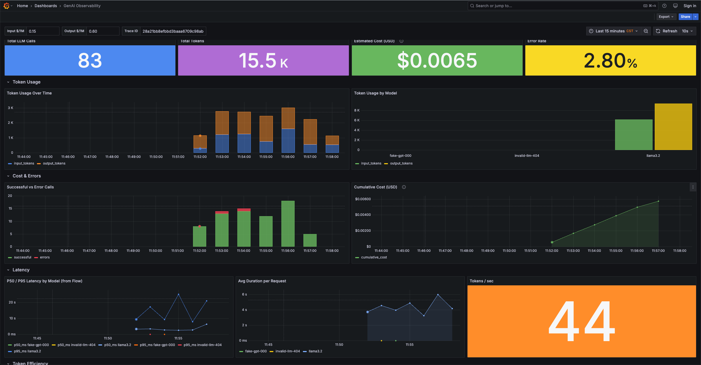
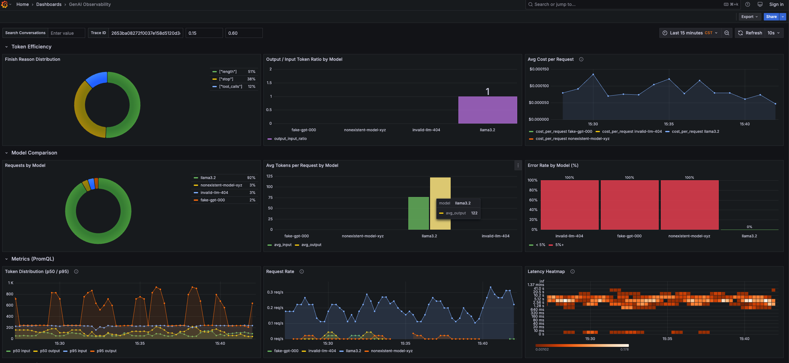
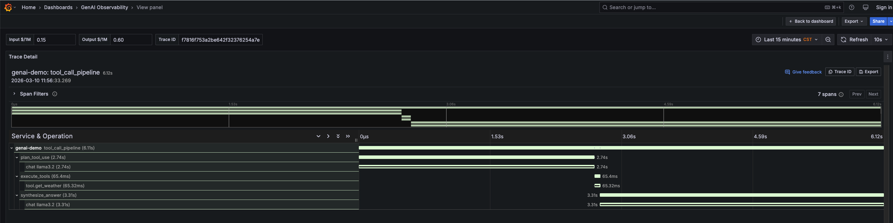

# GenAI Observability with GreptimeDB

Monitor LLM token usage, latency, cost, and conversation content using
OpenTelemetry GenAI semantic conventions (`gen_ai.*`) and GreptimeDB.

## Architecture

```
┌─────────────────────────────────────────────────┐
│  GenAI App (Python)                             │
│  OpenAI SDK + OTel GenAI Instrumentor           │
│  - chat completions                             │
│  - multi-model comparison                       │
│  - conversation content capture (logs)          │
└──────────────┬──────────────────────────────────┘
               │ OTLP (HTTP): traces + metrics + logs
┌──────────────▼──────────────────────────────────┐
│  GreptimeDB                                     │
│  - opentelemetry_traces (gen_ai.* attributes)   │
│  - genai_conversations  (prompt + completion)    │
│  - OTel metrics (histograms → PromQL)           │
│  - Flow: token usage / latency aggregation      │
├─────────────────────────────────────────────────┤
│  Grafana (pre-built dashboard)                  │
│  - SQL queries (traces, logs, Flow tables)      │
│  - PromQL queries (OTel histogram metrics)      │
│  - Trace waterfall (GreptimeDB plugin)          │
└─────────────────────────────────────────────────┘
```

## Quick Start

### Option A: OpenAI API (recommended)

```bash
export OPENAI_API_KEY="sk-..."

# Start all services + load generator + Flow aggregations
docker compose --profile load up -d
```

### Option B: Ollama (local, free)

```bash
docker compose --profile local up -d

# Pull a model
docker compose exec ollama ollama pull llama3.2

# Start load generator + Flow aggregations pointing to Ollama
OPENAI_BASE_URL=http://ollama:11434/v1 MODEL_NAME=llama3.2 \
  docker compose --profile load up -d
```

## Access

| Service              | URL                                   |
|----------------------|---------------------------------------|
| Grafana              | http://localhost:3000 (admin / admin) |
| GreptimeDB Dashboard | http://localhost:4000/dashboard        |
| GreptimeDB MySQL     | `mysql -h 127.0.0.1 -P 4002`         |

## Dashboard

The Grafana dashboard (`GenAI Observability`) has nine row sections: Overview, Token Usage, Cost & Errors, Latency, Token Efficiency, Model Comparison, Metrics (PromQL), Conversations, and Traces.

This showcases three GreptimeDB query interfaces:

- **SQL** — traces, logs, and Flow aggregation tables (MySQL datasource)
- **PromQL** — OTel histogram metrics for token distribution, request rate, latency heatmap (Prometheus datasource)
- **Trace waterfall** — via the [GreptimeDB Grafana plugin](https://github.com/GreptimeTeam/greptimedb-grafana-datasource)

Dashboard variables in the top bar:

- **Search Conversations** — full-text search over conversation content (`MATCHES()`)
- **Trace ID** — filter the trace waterfall by a specific trace. Click any `trace_id` in the Recent Traces or Conversations table to populate it.
- **Input $/1M** / **Output $/1M** — token pricing for cost estimation (default: gpt-4o-mini pricing)







## Example Queries

> **Tip:** You can run these queries interactively in the
> [GreptimeDB Dashboard](http://localhost:4000/dashboard/#/dashboard/query).

### Token Usage per Model per Minute

```sql
SELECT
    "span_attributes.gen_ai.request.model" AS model,
    date_bin('1 minute'::INTERVAL, timestamp) AS minute,
    COUNT(*) AS requests,
    SUM("span_attributes.gen_ai.usage.input_tokens") AS input_tokens,
    SUM("span_attributes.gen_ai.usage.output_tokens") AS output_tokens
FROM opentelemetry_traces
WHERE "span_attributes.gen_ai.system" IS NOT NULL
GROUP BY model, minute
ORDER BY minute DESC;
```

### Cost Estimation (OpenAI Pricing)

```sql
SELECT
    "span_attributes.gen_ai.request.model" AS model,
    SUM("span_attributes.gen_ai.usage.input_tokens") AS input_tokens,
    SUM("span_attributes.gen_ai.usage.output_tokens") AS output_tokens,
    ROUND(SUM("span_attributes.gen_ai.usage.input_tokens") * 0.15 / 1000000
        + SUM("span_attributes.gen_ai.usage.output_tokens") * 0.60 / 1000000, 4) AS estimated_cost_usd
FROM opentelemetry_traces
WHERE "span_attributes.gen_ai.system" IS NOT NULL
  AND timestamp > NOW() - INTERVAL '1 hour'
GROUP BY model
ORDER BY estimated_cost_usd DESC;
```

### Latency Percentiles (from Flow)

```sql
SELECT
    model,
    request_count,
    ROUND(uddsketch_calc(0.50, duration_sketch) / 1000000, 1) AS p50_ms,
    ROUND(uddsketch_calc(0.95, duration_sketch) / 1000000, 1) AS p95_ms,
    time_window
FROM genai_latency_1m
ORDER BY time_window DESC
LIMIT 20;
```

### Error Rate per Model

```sql
SELECT
    "span_attributes.gen_ai.request.model" AS model,
    COUNT(*) AS total,
    COUNT(CASE WHEN span_status_code = 'STATUS_CODE_ERROR' THEN 1 END) AS errors,
    ROUND(
        COUNT(CASE WHEN span_status_code = 'STATUS_CODE_ERROR' THEN 1 END) * 100.0 / COUNT(*),
        1
    ) AS error_rate_pct
FROM opentelemetry_traces
WHERE "span_attributes.gen_ai.system" IS NOT NULL
  AND timestamp > NOW() - INTERVAL '1 hour'
GROUP BY model
ORDER BY error_rate_pct DESC;
```

### Finish Reason Distribution

```sql
SELECT
    "span_attributes.gen_ai.response.finish_reasons" AS finish_reason,
    COUNT(*) AS count
FROM opentelemetry_traces
WHERE "span_attributes.gen_ai.system" IS NOT NULL
  AND timestamp > NOW() - INTERVAL '1 hour'
GROUP BY finish_reason
ORDER BY count DESC;
```

### Error Rate Trend (from Flow)

```sql
SELECT
    time_window,
    model,
    SUM(CASE WHEN span_status = 'STATUS_CODE_ERROR' THEN request_count ELSE 0 END) * 100.0
      / SUM(request_count) AS error_rate_pct
FROM genai_status_1m
GROUP BY time_window, model
ORDER BY time_window DESC;
```

### PromQL: Request Rate

```promql
sum(rate(gen_ai_client_operation_duration_seconds_count[5m])) by (gen_ai_request_model)
```

### PromQL: Token Distribution (p95)

```promql
histogram_quantile(0.95, sum(rate(gen_ai_client_token_usage_bucket[5m])) by (le, gen_ai_token_type))
```

### Conversations

```sql
SELECT
    timestamp AS time,
    trace_id,
    json_get_string(parse_json(body), 'message.role') AS role,
    COALESCE(
        json_get_string(parse_json(body), 'message.content'),
        json_get_string(parse_json(body), 'content')
    ) AS content
FROM genai_conversations
ORDER BY timestamp DESC
LIMIT 20;
```

### Full-text Search on Conversations

```sql
SELECT timestamp, trace_id,
    json_get_string(parse_json(body), 'message.role') AS role,
    json_get_string(parse_json(body), 'message.content') AS content
FROM genai_conversations
WHERE MATCHES(body, 'GreptimeDB')
ORDER BY timestamp DESC
LIMIT 20;
```

## How It Works

This demo uses [OpenTelemetry GenAI Semantic Conventions](https://opentelemetry.io/docs/specs/semconv/gen-ai/)
to automatically instrument OpenAI SDK calls. The `opentelemetry-instrumentation-openai-v2`
package captures:

- **Traces** — span attributes for each LLM call:
  - `gen_ai.system` — provider (e.g., "openai")
  - `gen_ai.request.model` — requested model name
  - `gen_ai.usage.input_tokens` / `gen_ai.usage.output_tokens` — token counts
  - `gen_ai.response.model` — actual model used
  - `gen_ai.response.finish_reasons` — why the model stopped generating
- **Logs** — full prompt and completion content (when `OTEL_INSTRUMENTATION_GENAI_CAPTURE_MESSAGE_CONTENT=true`), stored in the `genai_conversations` table. Each log record's `body` is a JSON string containing `message.role` and `message.content` (or `content`), extractable via `parse_json()` + `json_get_string()`. The `body` column has full-text indexing enabled, supporting `MATCHES()` for keyword search.
- **Metrics** — OTel histograms (`gen_ai.client.token.usage`, `gen_ai.client.operation.duration`) queryable via PromQL. Note: the OTel SDK appends unit suffixes to metric names (e.g., `gen_ai_client_operation_duration` becomes `gen_ai_client_operation_duration_seconds_count/bucket/sum`).

GreptimeDB's `greptime_trace_v1` pipeline flattens span attributes into
queryable columns, enabling SQL-based analysis on LLM telemetry. Logs are
ingested via the default OTLP log handler (no pipeline header needed) into
a custom table (`genai_conversations`) specified by the `X-Greptime-Log-Table-Name` header.

**Flow Aggregations** ([`flows.sql`](flows.sql)) create continuous materialized views for:
- `genai_token_usage_1m` — token counts per model per minute
- `genai_latency_1m` — latency distribution (uddsketch) per model per minute
- `genai_status_1m` — request counts by model and status code per minute

> **Note:** This demo sends OTLP data directly to GreptimeDB without an OTel Collector
> in between, keeping the architecture minimal. In production you'd typically add a
> Collector for buffering/retry, fan-out to multiple backends, sampling, and PII redaction.

> **Privacy:** This demo captures full prompt and completion content by default
> (`OTEL_INSTRUMENTATION_GENAI_CAPTURE_MESSAGE_CONTENT=true`). In production, disable
> this or use an OTel Collector with redaction processors to protect sensitive data.

## Environment Variables

| Variable           | Default         | Description                              |
|--------------------|-----------------|------------------------------------------|
| `OPENAI_API_KEY`   | *(empty)*       | OpenAI API key                           |
| `OPENAI_BASE_URL`  | *(empty)*       | Custom base URL (for Ollama, etc.)       |
| `MODEL_NAME`       | `gpt-4o-mini`   | Model to use                             |
| `RPS`              | `0.5`           | Requests per second (load generator)     |
| `MODELS`           | `$MODEL_NAME`   | Comma-separated model list for comparison |
| `OTEL_INSTRUMENTATION_GENAI_CAPTURE_MESSAGE_CONTENT` | `true` | Capture prompt/completion in logs |

## Cleanup

```bash
docker compose --profile load --profile local down -v
```
