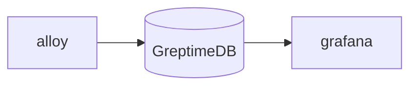

# Grafana Alloy with GreptimeDB

This docker-compose file demos how to ingest data from Grafana Alloy to
GreptimeDB.

It uses [Grafana Alloy](https://grafana.com/docs/alloy) as a Prometheus data
source (combination of Prometheus Node Exporter and Prometheus Agent), and use
remote write protocol to ingest data into GreptimeDB.

## How to run this demo

Ensure you have `git`, `docker`, `docker-compose` and `mysql` client
installed. To run this demo:

```shell
git clone https://github.com/GreptimeTeam/demo-scene.git
cd demo-scene/grafana-alloy
docker compose up
```

You can access GreptimeDB using `mysql` client. Just run `mysql -h 127.0.0.1 -P
4002` to connect to the database and use SQL query like `SHOW TABLES` as a
start.

```
mysql -h 127.0.0.1 -P 4002
Welcome to the MySQL monitor.  Commands end with ; or \g.
Your MySQL connection id is 8
Server version: 8.4.2 Greptime

Copyright (c) 2000, 2024, Oracle and/or its affiliates.

Oracle is a registered trademark of Oracle Corporation and/or its
affiliates. Other names may be trademarks of their respective
owners.

Type 'help;' or '\h' for help. Type '\c' to clear the current input statement.

mysql> show tables;
+---------------------------------------------+
| Tables                                      |
+---------------------------------------------+
| greptime_physical_table                     |
| node_boot_time_seconds                      |
| node_context_switches_total                 |
| node_cooling_device_cur_state               |
| node_cooling_device_max_state               |
| node_cpu_frequency_hertz                    |
| node_cpu_frequency_max_hertz                |
| node_cpu_frequency_min_hertz                |
| node_cpu_scaling_frequency_hertz            |
| node_cpu_scaling_frequency_max_hertz        |
| node_cpu_scaling_frequency_min_hertz        |
| node_cpu_scaling_governor                   |
| node_cpu_seconds_total                      |
| node_disk_discard_time_seconds_total        |
| node_disk_discarded_sectors_total           |
| node_disk_discards_completed_total          |
| node_disk_discards_merged_total             |
| ...                                         |
```

## How it works

The topology is illustrated in this diagram.



## Run in GreptimeCloud

By default, this example writes data into a GreptimeDB instance within the
docker compose. It's also possible to write to your own GreptimeCloud instance
by creating a `greptime.env` file from our sample `greptime.env.sample` and
providing your host, dbname and authentication information. Then use `docker
compose down` and `docker compose up` to recreate the compose cluster and apply
new settings.
