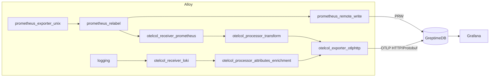
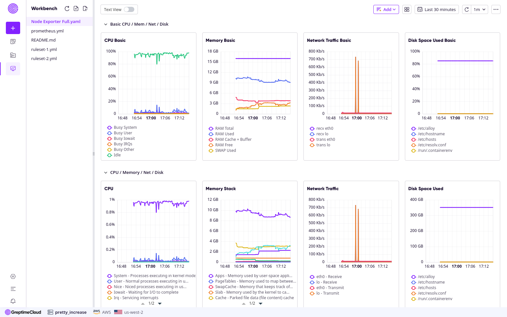
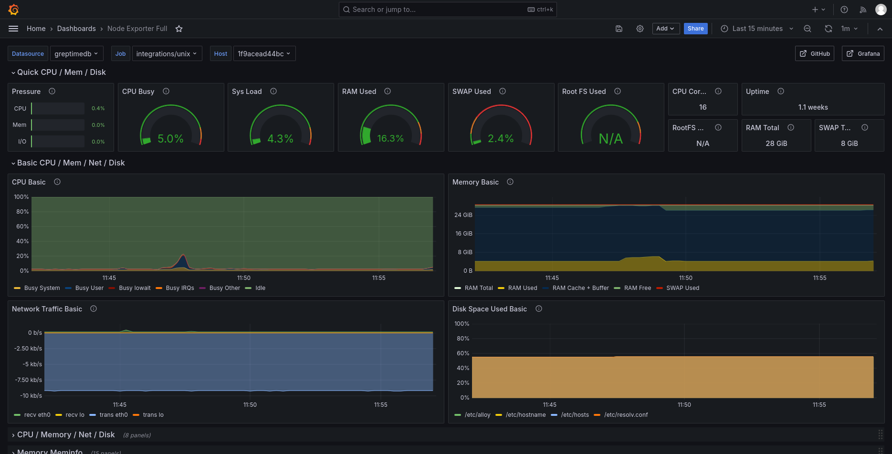
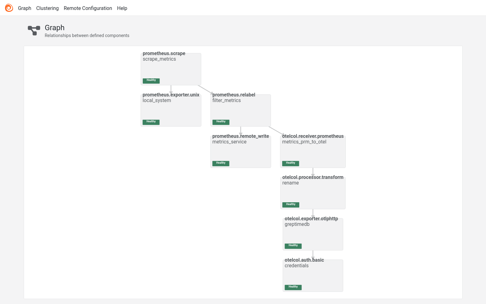
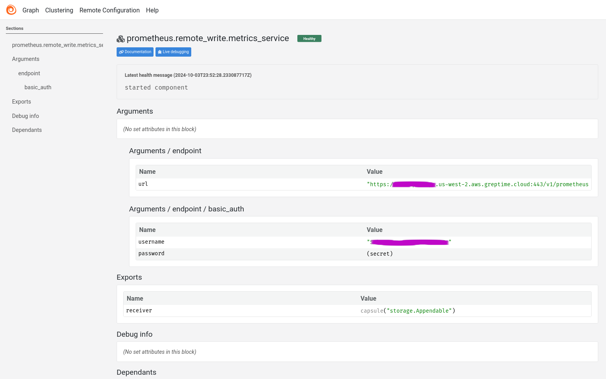

# OpenTelemetry and Grafana Alloy with GreptimeDB

This docker-compose file demos how to ingest data from Grafana Alloy to
GreptimeDB, as well as using GreptimeDB as an OpenTelemetry data collector.

It uses [Grafana Alloy](https://grafana.com/docs/alloy) as a Prometheus data
source (combination of Prometheus Node Exporter and Prometheus Agent), and
ingest data into GreptimeDB using following protocols:

- Prometheus Remote Write
- OpenTelemetry OTLP

In the real world, you will use Grafana Alloy as a Prometheus agent or an
OpenTelemetry data collector, with both sinks connected to GreptimeDB.

Additionally, we send Alloy meta logs to GreptimeDB via OpenTelemetry as well.

## How to run this demo

Ensure you have `git`, `docker`, `docker-compose` and `mysql` client
installed. Docker Compose version 2.24 or higher is required. To run this
demo:

```shell
git clone https://github.com/GreptimeTeam/demo-scene.git
cd demo-scene/grafana-alloy
docker compose up
```

You can access GreptimeDB using `mysql` client. Just run `mysql -h 127.0.0.1 -P
4002` to connect to the database and use SQL query like `SHOW TABLES` as a
start.

```
mysql -h 127.0.0.1 -P 4002
Welcome to the MySQL monitor.  Commands end with ; or \g.
Your MySQL connection id is 8
Server version: 8.4.2 Greptime

Copyright (c) 2000, 2024, Oracle and/or its affiliates.

Oracle is a registered trademark of Oracle Corporation and/or its
affiliates. Other names may be trademarks of their respective
owners.

Type 'help;' or '\h' for help. Type '\c' to clear the current input statement.

mysql> show tables;
+---------------------------------------------+
| Tables                                      |
+---------------------------------------------+
| greptime_physical_table                     |
| node_boot_time_seconds                      |
| node_context_switches_total                 |
| node_cooling_device_cur_state               |
| node_cooling_device_max_state               |
| node_cpu_frequency_hertz                    |
| node_cpu_frequency_max_hertz                |
| node_cpu_frequency_min_hertz                |
| node_cpu_scaling_frequency_hertz            |
| node_cpu_scaling_frequency_max_hertz        |
| node_cpu_scaling_frequency_min_hertz        |
| node_cpu_scaling_governor                   |
| node_cpu_seconds_total                      |
| node_disk_discard_time_seconds_total        |
| node_disk_discarded_sectors_total           |
| node_disk_discards_completed_total          |
| node_disk_discards_merged_total             |
| ...                                         |
```

## How it works

The topology is illustrated in this diagram.



Grafana Alloy is a telemetry data pipeline that ingests data in Prometheus,
Loki, and OpenTelemetry formats. It also provides processing capabilities, such
as Prometheus relabeling and OpenTelemetry OTTL (OpenTelemetry Transformation
Language) functions.

In this example, we generate metrics data from Alloy's built-in data source
called `prometheus.exporter.unix` and export the data to both a Prometheus
remote write sink and an OpenTelemetry-compatible collector, which is
GreptimeDB.

## Run in GreptimeCloud

By default, this example writes data into a GreptimeDB instance within the
docker compose. It's also possible to write to your own GreptimeCloud instance
by creating a `greptime.env` file from our sample `greptime.env.sample` and
providing your host, dbname and authentication information.Then use `docker
compose down` and `docker compose up` to recreate the compose cluster and apply
new settings.

## Screenshots

GreptimeCloud Visualization



Grafana Dashboard



Grafana Alloy Topology Graph



Grafana Alloy Component Detail



## What's Next

- Use Grafana Alloy for Log ingestion into GreptimeDB
