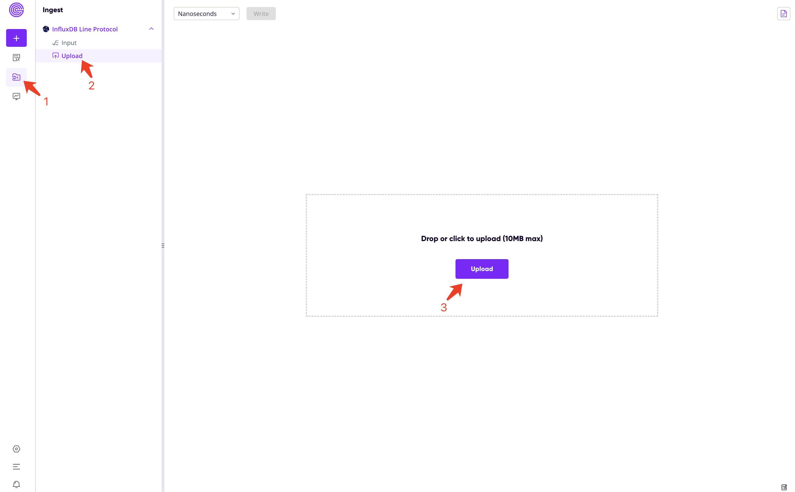
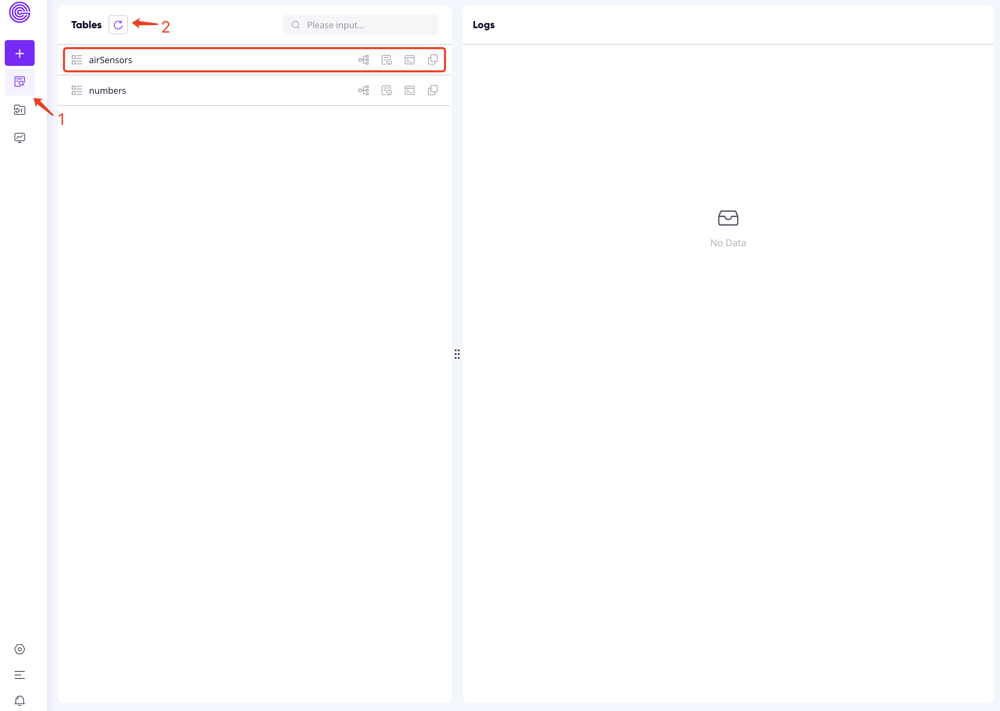
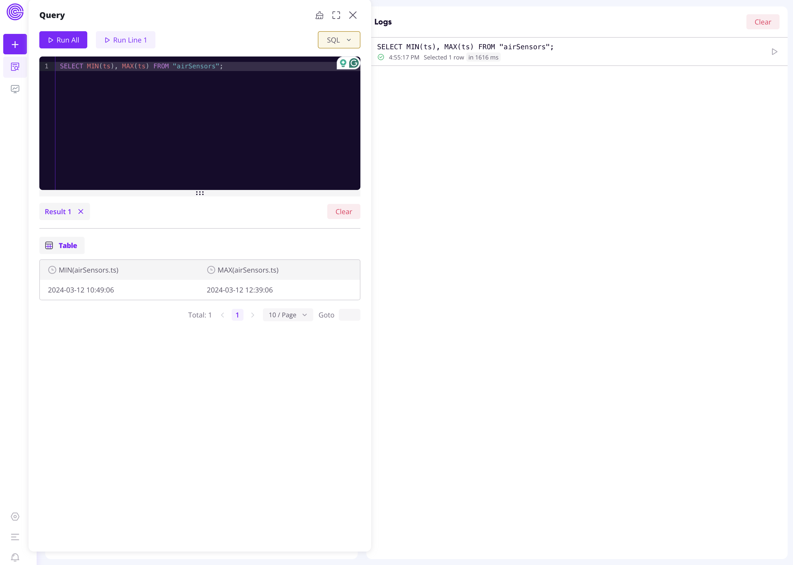
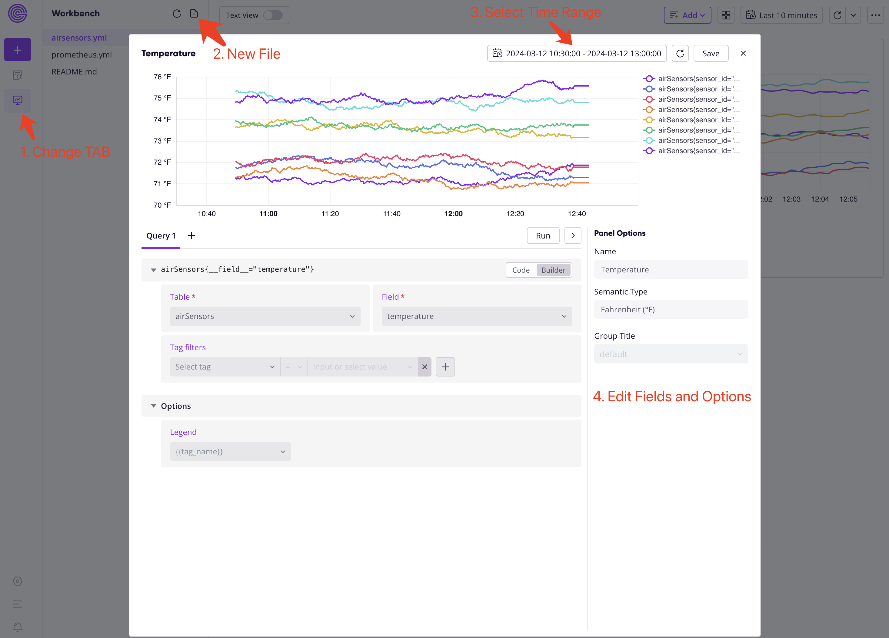
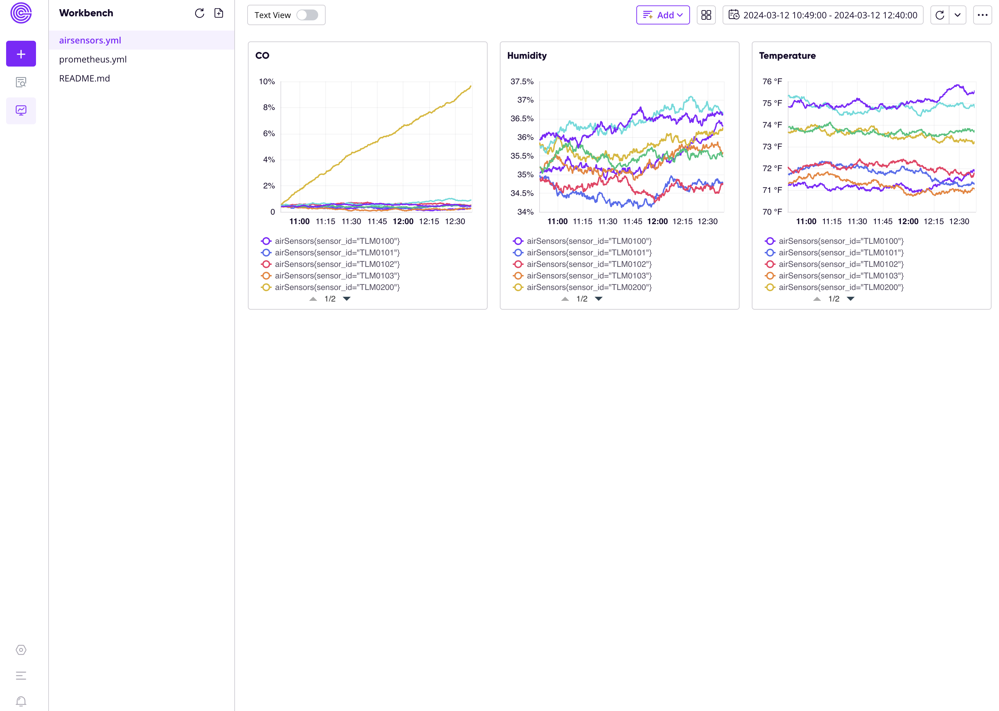

# Ingestion with InfluxDB Line Protocol, Analysis with SQL and PromQL

## Prerequisites

* [Docker](https://docs.docker.com/get-docker/) or [OrbStack](https://orbstack.dev/)
* [Python 3.7 or later](https://www.python.org/downloads/)

Other dependencies can be installed by:

```shell
pip3 install -r requirements.txt
```

## Step 1: Set up Greptime service

1. Obtain a free Greptime service from [GreptimeCloud](https://console.greptime.cloud/). 
2. Go to the "Connect" tab and find the connection string.
3. Copy `.env.example` to `.env` and set the connection string.


## Step 2A: Write data via line protocol

Download the sample data:

```shell
curl -O https://raw.githubusercontent.com/influxdata/influxdb2-sample-data/master/air-sensor-data/air-sensor-data.lp 
```

> [!TIP]
>
> Use `https://mirror.ghproxy.com/https://raw.githubusercontent.com/influxdata/influxdb2-sample-data/master/air-sensor-data/air-sensor-data.lp` if you encounter network issues.

Ingest the air sensors data with:

```shell
python3 ingest.py air-sensor-data.lp
```

The script supports ingesting any data in [line protocol format](https://docs.influxdata.com/influxdb/v2/reference/syntax/line-protocol/). You can specify the data file and timestamp precision:

```
$ python3 ingest.py --help
usage: ingest.py [-h] [--precision PRECISION] file

positional arguments:
  file                  File to ingest

options:
  -h, --help            show this help message and exit
  --precision PRECISION
                        Precision of the data (default: ns)
```

## Step 2B: Improt line protocol files via Web Dashboard

Instead, you can import the line protofol file via Web Dashboard.




Once file uploaded, click the "Write" button next to the precision box to ingest data. The line protocol file downloaded above is in nanoseconds (default), so we don't need to change the precision.

The data should be written immediately. Then you can go to the "Tables" tab, reload tables, and find the `airSensors` table.



## Step 3: Query data with SQL and PromQL

The following sample queries are executed from the Web Dashboard.

### Find the time range of data with SQL

```sql
SELECT MIN(ts), MAX(ts) FROM "airSensors";
```



### Add panels with PromQL

1. Click the second icon in the sidebar; go to the workbench page.
2. Click "+" to create a new panel file `airsensors.yml`.
3. Start your dashboard by "+Add panel".
4. Select time range and fill the fields.



The final panels would be like:


