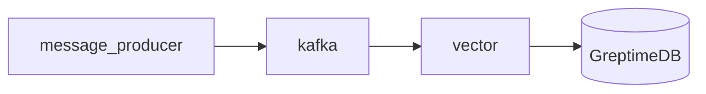

# GreptimeDB Kafka Ingestion Demo

This docker-compose file demos how to ingest log data from Kafka to GreptimeDB.

It uses [Vector](https://vector.dev) as Kafka consumer to bridge Kafka and
GreptimeDB. Vector is a observability data pipeline that has built-in support
for Kafka as source and GreptimeDB as sinks.

## How to run this demo

Ensure you have `git`, `docker`, `docker-compose` and `mysql` client
installed. To run this demo:

```shell
git clone https://github.com/GreptimeTeam/demo-scene.git
cd demo-scene/kafka-ingestion
docker compose up
```

It can take a while for the first run to pull down images and also build
necessary components.

You can access GreptimeDB using `mysql` client. Just run `mysql -h 127.0.0.1 -P
4002` to connect to the database and use SQL query like `SHOW TABLES` as a
start.

```
mysql -h 127.0.0.1 -P 4002
Welcome to the MySQL monitor.  Commands end with ; or \g.
Your MySQL connection id is 8
Server version: 8.4.2 Greptime

Copyright (c) 2000, 2024, Oracle and/or its affiliates.

Oracle is a registered trademark of Oracle Corporation and/or its
affiliates. Other names may be trademarks of their respective
owners.

Type 'help;' or '\h' for help. Type '\c' to clear the current input statement.

mysql> show tables;
+-------------+
| Tables      |
+-------------+
| demo_logs   |
| monitor_cpu |
| numbers     |
+-------------+
3 rows in set (0.00 sec)

mysql> select * from demo_logs order by timestamp desc limit 10;
+-----------+--------+------+----------+------------------------------------------------------------------------+--------+------+---------------------+----------------------------+
| ip        | method | path | protocol | user_agent                                                             | status | size | datetime            | timestamp                  |
+-----------+--------+------+----------+------------------------------------------------------------------------+--------+------+---------------------+----------------------------+
| 127.0.0.1 | GET    | /    | HTTP/1.1 | Mozilla/5.0 (X11; Linux x86_64; rv:130.0) Gecko/20100101 Firefox/130.0 |    200 |  615 | 2024-09-04 22:46:13 | 2024-09-18 09:05:41.651000 |
| 127.0.0.1 | GET    | /    | HTTP/1.1 | Mozilla/5.0 (X11; Linux x86_64; rv:130.0) Gecko/20100101 Firefox/130.0 |    200 |  615 | 2024-09-04 22:46:13 | 2024-09-18 09:05:38.647000 |
| 127.0.0.1 | GET    | /    | HTTP/1.1 | Mozilla/5.0 (X11; Linux x86_64; rv:130.0) Gecko/20100101 Firefox/130.0 |    200 |  615 | 2024-09-04 22:46:13 | 2024-09-18 09:05:35.642000 |
| 127.0.0.1 | GET    | /    | HTTP/1.1 | Mozilla/5.0 (X11; Linux x86_64; rv:130.0) Gecko/20100101 Firefox/130.0 |    200 |  615 | 2024-09-04 22:46:13 | 2024-09-18 09:05:32.639000 |
| 127.0.0.1 | GET    | /    | HTTP/1.1 | Mozilla/5.0 (X11; Linux x86_64; rv:130.0) Gecko/20100101 Firefox/130.0 |    200 |  615 | 2024-09-04 22:46:13 | 2024-09-18 09:05:29.635000 |
| 127.0.0.1 | GET    | /    | HTTP/1.1 | Mozilla/5.0 (X11; Linux x86_64; rv:130.0) Gecko/20100101 Firefox/130.0 |    200 |  615 | 2024-09-04 22:46:13 | 2024-09-18 09:05:26.632000 |
| 127.0.0.1 | GET    | /    | HTTP/1.1 | Mozilla/5.0 (X11; Linux x86_64; rv:130.0) Gecko/20100101 Firefox/130.0 |    200 |  615 | 2024-09-04 22:46:13 | 2024-09-18 09:05:23.628000 |
| 127.0.0.1 | GET    | /    | HTTP/1.1 | Mozilla/5.0 (X11; Linux x86_64; rv:130.0) Gecko/20100101 Firefox/130.0 |    200 |  615 | 2024-09-04 22:46:13 | 2024-09-18 09:05:20.624000 |
| 127.0.0.1 | GET    | /    | HTTP/1.1 | Mozilla/5.0 (X11; Linux x86_64; rv:130.0) Gecko/20100101 Firefox/130.0 |    200 |  615 | 2024-09-04 22:46:13 | 2024-09-18 09:05:17.620000 |
| 127.0.0.1 | GET    | /    | HTTP/1.1 | Mozilla/5.0 (X11; Linux x86_64; rv:130.0) Gecko/20100101 Firefox/130.0 |    200 |  615 | 2024-09-04 22:46:13 | 2024-09-18 09:05:14.616000 |
+-----------+--------+------+----------+------------------------------------------------------------------------+--------+------+---------------------+----------------------------+
10 rows in set (0.00 sec)

mysql> desc demo_logs;
+------------+---------------------+------+------+---------+---------------+
| Column     | Type                | Key  | Null | Default | Semantic Type |
+------------+---------------------+------+------+---------+---------------+
| ip         | String              |      | YES  |         | FIELD         |
| method     | String              |      | YES  |         | FIELD         |
| path       | String              |      | YES  |         | FIELD         |
| protocol   | String              |      | YES  |         | FIELD         |
| user_agent | String              |      | YES  |         | FIELD         |
| status     | UInt32              |      | YES  |         | FIELD         |
| size       | UInt32              |      | YES  |         | FIELD         |
| datetime   | TimestampNanosecond | PRI  | NO   |         | TIMESTAMP     |
| timestamp  | TimestampNanosecond |      | YES  |         | FIELD         |
+------------+---------------------+------+------+---------+---------------+
9 rows in set (0.00 sec)
```

You can also open your browser at http://localhost:4000/dashboard for the Web
UI.

## How it works

The topology is illustrated in this diagram. One-shot containers are ignored.



All the generated logs are stored in GreptimeDB using a pipeline definition at
[pipeline.yaml](./config_data/pipeline.yaml). Basically, it extracts timestamp
and message fields from the data Vector sents to GreptimeDB and stores them as
table columns.

Once greptimedb starts, we use an init container `init_pipeline` to send a http
post call to store the pipeline definition named as `demo_pipeline`.

In the [vector configuration](./config_data/vector.toml), we specify the
pipeline name `demo_pipeline` and table name `demo_logs` (you can customize it).

To learn more about logs and pipeline definition, [see our
docs](https://docs.greptime.com/user-guide/logs/overview).

## Note

If you are going to restart this demo, press `Ctrl-C` and remember to call
`docker compose down` to clean up the data before you run `docker compose up`
again.
