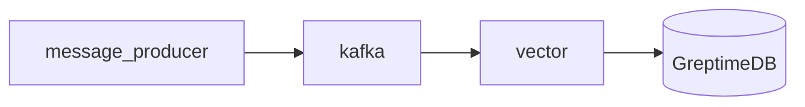

# GreptimeDB Kafka Ingestion Demo

This docker-compose file demos how to ingest log data from Kafka to GreptimeDB.

It uses [Vector](https://vector.dev) as Kafka consumer to bridge Kafka and
GreptimeDB. Vector is a observability data pipeline that has built-in support
for Kafka as source and GreptimeDB as sinks.

## How to run this demo

Ensure you have `git`, `docker`, `docker-compose` and `mysql` client
installed. To run this demo:

```shell
git clone https://github.com/GreptimeTeam/demo-scene.git
cd demo-scene/kafka-ingestion
docker compose up
```

It can take a while for the first run to pull down images and also build
necessary components.

You can access GreptimeDB using `mysql` client. Just run `mysql -h 127.0.0.1 -P
4002` to connect to the database and use SQL query like `SHOW TABLES` as a
start.

```
mysql -h 127.0.0.1 -P 4002
Welcome to the MySQL monitor.  Commands end with ; or \g.
Your MySQL connection id is 8
Server version: 8.4.2 Greptime

Copyright (c) 2000, 2024, Oracle and/or its affiliates.

Oracle is a registered trademark of Oracle Corporation and/or its
affiliates. Other names may be trademarks of their respective
owners.

Type 'help;' or '\h' for help. Type '\c' to clear the current input statement.

mysql> show tables;
+-------------+
| Tables      |
+-------------+
| demo_logs   |
| monitor_cpu |
| numbers     |
+-------------+
3 rows in set (0.00 sec)

mysql> select * from demo_logs order by timestamp desc limit 15;
+-----------------+--------+----------+----------+-----------------------------------------------------------------------------------------------------------------------------------------------------+--------+------+---------------------+----------------------------+
| ip              | method | path     | protocol | user_agent                                                                                                                                          | status | size | datetime            | timestamp                  |
+-----------------+--------+----------+----------+-----------------------------------------------------------------------------------------------------------------------------------------------------+--------+------+---------------------+----------------------------+
| 28.0.250.103    | GET    | /        | HTTP/1.1 | Mozilla/5.0 (Linux; U; Android 2.2.1; zh-cn; HTC_Wildfire_A3333 Build/FRG83D) AppleWebKit/533.1 (KHTML, like Gecko) Version/4.0 Mobile Safari/533.1 |    200 |  162 | 2024-09-19 03:44:32 | 2024-09-19 03:44:32.172000 |
| 76.75.15.140    | POST   | /contact | HTTP/1.1 | Mozilla/5.0 (iPad; U; CPU OS 4_3_3 like Mac OS X; en-us) AppleWebKit/533.17.9 (KHTML, like Gecko) Version/5.0.2 Mobile/8J2 Safari/6533.18.5         |    201 |  437 | 2024-09-19 03:44:29 | 2024-09-19 03:44:29.168000 |
| 142.32.59.93    | PUT    | /blog    | HTTP/2.0 | Mozilla/4.0 (compatible; MSIE 7.0; Windows NT 5.1; Avant Browser)                                                                                   |    404 |  842 | 2024-09-19 03:44:26 | 2024-09-19 03:44:26.165000 |
| 162.84.33.98    | PUT    | /about   | HTTP/1.1 | UCWEB7.0.2.37/28/999                                                                                                                                |    500 |  227 | 2024-09-19 03:44:23 | 2024-09-19 03:44:23.164000 |
| 55.142.233.127  | PUT    | /blog    | HTTP/1.1 | Opera/9.80 (Windows NT 6.1; U; en) Presto/2.8.131 Version/11.11                                                                                     |    404 |  568 | 2024-09-19 03:44:20 | 2024-09-19 03:44:20.161000 |
| 207.190.178.233 | GET    | /contact | HTTP/1.1 | Mozilla/4.0 (compatible; MSIE 7.0; Windows NT 5.1; Trident/4.0; SV1; QQDownload 732; .NET4.0C; .NET4.0E; SE 2.X MetaSr 1.0)                         |    200 |  812 | 2024-09-19 03:44:17 | 2024-09-19 03:44:17.157000 |
| 130.138.180.236 | GET    | /        | HTTP/2.0 | Mozilla/5.0 (Windows NT 6.1; WOW64) AppleWebKit/536.11 (KHTML, like Gecko) Chrome/20.0.1132.11 TaoBrowser/2.0 Safari/536.11                         |    404 |  517 | 2024-09-19 03:44:14 | 2024-09-19 03:44:14.154000 |
| 12.146.223.64   | PUT    | /blog    | HTTP/2.0 | Mozilla/5.0 (Windows NT 6.1; WOW64) AppleWebKit/537.36 (KHTML, like Gecko) Chrome/55.0.2883.87 UBrowser/6.2.4094.1 Safari/537.36                    |    404 |  145 | 2024-09-19 03:44:11 | 2024-09-19 03:44:11.150000 |
| 240.243.25.80   | GET    | /blog    | HTTP/1.1 | Mozilla/4.0 (compatible; MSIE 7.0; Windows NT 5.1; Trident/4.0; SV1; QQDownload 732; .NET4.0C; .NET4.0E; SE 2.X MetaSr 1.0)                         |    200 |  869 | 2024-09-19 03:44:08 | 2024-09-19 03:44:08.147000 |
| 14.117.122.189  | DELETE | /        | HTTP/1.1 | Mozilla/5.0 (Linux; U; Android 2.3.7; en-us; Nexus One Build/FRF91) AppleWebKit/533.1 (KHTML, like Gecko) Version/4.0 Mobile Safari/533.1           |    404 |  191 | 2024-09-19 03:44:05 | 2024-09-19 03:44:05.142000 |
| 55.67.247.103   | POST   | /        | HTTP/1.1 | Mozilla/5.0 (Windows NT 6.1; WOW64) AppleWebKit/534.57.2 (KHTML, like Gecko) Version/5.1.7 Safari/534.57.2                                          |    200 |  151 | 2024-09-19 03:44:02 | 2024-09-19 03:44:02.138000 |
| 107.235.244.182 | GET    | /blog    | HTTP/1.1 | Mozilla/4.0 (compatible; MSIE 6.0; Windows NT 5.1; en) Opera 9.50                                                                                   |    404 |  340 | 2024-09-19 03:43:59 | 2024-09-19 03:43:59.135000 |
| 24.11.217.6     | POST   | /blog    | HTTP/2.0 | Mozilla/5.0 (Linux; U; Android 2.3.7; en-us; Nexus One Build/FRF91) AppleWebKit/533.1 (KHTML, like Gecko) Version/4.0 Mobile Safari/533.1           |    404 |  523 | 2024-09-19 03:43:56 | 2024-09-19 03:43:56.131000 |
| 197.9.255.166   | GET    | /        | HTTP/2.0 | Mozilla/5.0 (Windows NT 6.1; WOW64) AppleWebKit/536.11 (KHTML, like Gecko) Chrome/20.0.1132.11 TaoBrowser/2.0 Safari/536.11                         |    500 |  240 | 2024-09-19 03:43:53 | 2024-09-19 03:43:53.127000 |
| 207.158.217.64  | POST   | /about   | HTTP/1.1 | Mozilla/5.0 (compatible; MSIE 9.0; Windows NT 6.1; Trident/5.0;                                                                                     |    404 |  509 | 2024-09-19 03:43:50 | 2024-09-19 03:43:50.123000 |
+-----------------+--------+----------+----------+-----------------------------------------------------------------------------------------------------------------------------------------------------+--------+------+---------------------+----------------------------+
15 rows in set (0.00 sec)

mysql> desc demo_logs;
+------------+---------------------+------+------+---------+---------------+
| Column     | Type                | Key  | Null | Default | Semantic Type |
+------------+---------------------+------+------+---------+---------------+
| ip         | String              |      | YES  |         | FIELD         |
| method     | String              | PRI  | YES  |         | TAG           |
| protocol   | String              | PRI  | YES  |         | TAG           |
| path       | String              |      | YES  |         | FIELD         |
| user_agent | String              |      | YES  |         | FIELD         |
| status     | UInt32              | PRI  | YES  |         | TAG           |
| size       | UInt32              |      | YES  |         | FIELD         |
| datetime   | TimestampNanosecond | PRI  | NO   |         | TIMESTAMP     |
| timestamp  | TimestampNanosecond |      | YES  |         | FIELD         |
+------------+---------------------+------+------+---------+---------------+
9 rows in set (0.00 sec)

mysql> select * from monitor_cpu order by ts desc limit 15;
+----------------------------+-------+---------+------+--------+--------------------+
| ts                         | host  | region  | size | vendor | val                |
+----------------------------+-------+---------+------+--------+--------------------+
| 2024-09-19 03:46:12.310000 | host1 | eu-east | m    | Azure  |   81.1847434699629 |
| 2024-09-19 03:46:09.305000 | host2 | eu-west | s    | Azure  | 47.471702382943604 |
| 2024-09-19 03:46:06.302000 | host1 | eu-west | m    | Azure  |  10.62541620347205 |
| 2024-09-19 03:46:03.298000 | host2 | eu-east | l    | Azure  |   60.0293939887678 |
| 2024-09-19 03:46:00.294000 | host2 | eu-east | xl   | AWS    |  50.92738133733691 |
| 2024-09-19 03:45:57.290000 | host2 | eu-west | s    | Azure  |  6.071477553328142 |
| 2024-09-19 03:45:54.285000 | host1 | eu-east | l    | Azure  |  88.49961065662427 |
| 2024-09-19 03:45:51.281000 | host3 | eu-west | s    | Azure  |  54.83269013700283 |
| 2024-09-19 03:45:48.277000 | host1 | eu-east | l    | Azure  |  84.48387978112943 |
| 2024-09-19 03:45:45.271000 | host2 | us-west | xl   | Azure  |  96.22845331414254 |
| 2024-09-19 03:45:42.268000 | host1 | us-west | m    | GCP    | 29.737405055642952 |
| 2024-09-19 03:45:39.263000 | host1 | eu-west | l    | GCP    |  6.580741027423609 |
| 2024-09-19 03:45:36.260000 | host2 | eu-west | l    | AWS    | 14.249790844756994 |
| 2024-09-19 03:45:33.255000 | host1 | us-west | m    | Azure  |  98.00983620747533 |
| 2024-09-19 03:45:30.250000 | host1 | us-west | s    | GCP    |   76.0098811353222 |
+----------------------------+-------+---------+------+--------+--------------------+
15 rows in set (0.00 sec)

mysql> desc monitor_cpu;
+--------+----------------------+------+------+---------+---------------+
| Column | Type                 | Key  | Null | Default | Semantic Type |
+--------+----------------------+------+------+---------+---------------+
| ts     | TimestampMillisecond | PRI  | NO   |         | TIMESTAMP     |
| host   | String               | PRI  | YES  |         | TAG           |
| region | String               | PRI  | YES  |         | TAG           |
| size   | String               | PRI  | YES  |         | TAG           |
| vendor | String               | PRI  | YES  |         | TAG           |
| val    | Float64              |      | YES  |         | FIELD         |
+--------+----------------------+------+------+---------+---------------+
6 rows in set (0.00 sec)
```

You can also open your browser at http://localhost:4000/dashboard for the Web
UI.

## How it works

The topology is illustrated in this diagram. One-shot containers are ignored.



All the generated logs are stored in GreptimeDB using a pipeline definition at
[pipeline.yaml](./config_data/pipeline.yaml). Basically, it extracts timestamp
and message fields from the data Vector sents to GreptimeDB and stores them as
table columns.

Once greptimedb starts, we use an init container `init_pipeline` to send a http
post call to store the pipeline definition named as `demo_pipeline`.

In the [vector configuration](./config_data/vector.toml), we specify the
pipeline name `demo_pipeline` and table name `demo_logs` (you can customize it).

To learn more about logs and pipeline definition, [see our
docs](https://docs.greptime.com/user-guide/logs/overview).

## Note

If you are going to restart this demo, press `Ctrl-C` and remember to call
`docker compose down` to clean up the data before you run `docker compose up`
again.
