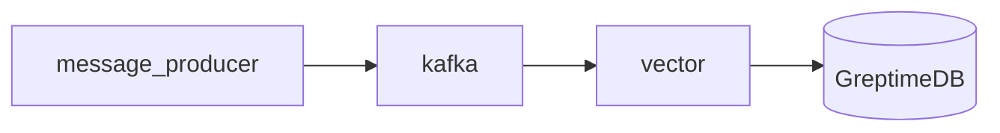

# GreptimeDB Kafka Ingestion Demo

This docker-compose file demos how to ingest log data from Kafka to GreptimeDB.

It uses [Vector](https://vector.dev) as Kafka consumer to bridge Kafka and
GreptimeDB. Vector is a observability data pipeline that has built-in support
for Kafka as source and GreptimeDB as sinks.

## How to run this demo

Ensure you have `git`, `docker`, `docker-compose` and `mysql` client
installed. To run this demo:

```shell
git clone https://github.com/GreptimeTeam/demo-scene.git
cd demo-scene/kafka-ingestion
docker compose up
```

It can take a while for the first run to pull down images and also build
necessary components.

You can access GreptimeDB using `mysql` client. Just run `mysql -h 127.0.0.1 -P
4002` to connect to the database and use SQL query like `SHOW TABLES` as a
start.

```
$ mysql -h 127.0.0.1 -P 4002
mysql: Deprecated program name. It will be removed in a future release, use '/usr/bin/mariadb' instead
WARNING: option --ssl-verify-server-cert is disabled, because of an insecure passwordless login.
Welcome to the MariaDB monitor.  Commands end with ; or \g.
Your MySQL connection id is 8
Server version: 8.4.2 Greptime

Copyright (c) 2000, 2018, Oracle, MariaDB Corporation Ab and others.

Type 'help;' or '\h' for help. Type '\c' to clear the current input statement.

MySQL [(none)]> show tables;
+-----------+
| Tables    |
+-----------+
| demo_logs |
| numbers   |
+-----------+
2 rows in set (0.009 sec)

MySQL [(none)]> select * from demo_logs order by timestamp desc limit 10;
+------------------------+----------------------------+
| message                | timestamp                  |
+------------------------+----------------------------+
| this is a test message | 2024-08-20 08:46:50.700000 |
| this is a test message | 2024-08-20 08:46:47.696000 |
| this is a test message | 2024-08-20 08:46:44.693000 |
| this is a test message | 2024-08-20 08:46:41.689000 |
| this is a test message | 2024-08-20 08:46:38.685000 |
| this is a test message | 2024-08-20 08:46:35.682000 |
| this is a test message | 2024-08-20 08:46:32.679000 |
| this is a test message | 2024-08-20 08:46:29.675000 |
| this is a test message | 2024-08-20 08:46:26.671000 |
| this is a test message | 2024-08-20 08:46:23.668000 |
+------------------------+----------------------------+
10 rows in set (0.005 sec)

MySQL [(none)]> Bye
```

You can also open your browser at http://localhost:4000/dashboard for the Web
UI.

## How it works

The topology is illustrated in this diagram. One-shot containers are ignored.



All the generated logs are stored in GreptimeDB using a pipeline definition at
[pipeline.yaml](./config_data/pipeline.yaml). Basically, it extracts timestamp
and message fields from the data Vector sents to GreptimeDB and stores them as
table columns.

Once greptimedb starts, we use an init container `init_pipeline` to send a http
post call to store the pipeline definition named as `demo_pipeline`.

In the [vector configuration](./config_data/vector.toml), we specify the
pipeline name `demo_pipeline` and table name `demo_logs` (you can customize it).

To learn more about logs and pipeline definition, [see our
docs](https://docs.greptime.com/user-guide/logs/overview).

## Note

If you are going to restart this demo, press `Ctrl-C` and remember to call
`docker compose down` to clean up the data before you run `docker compose up`
again.
