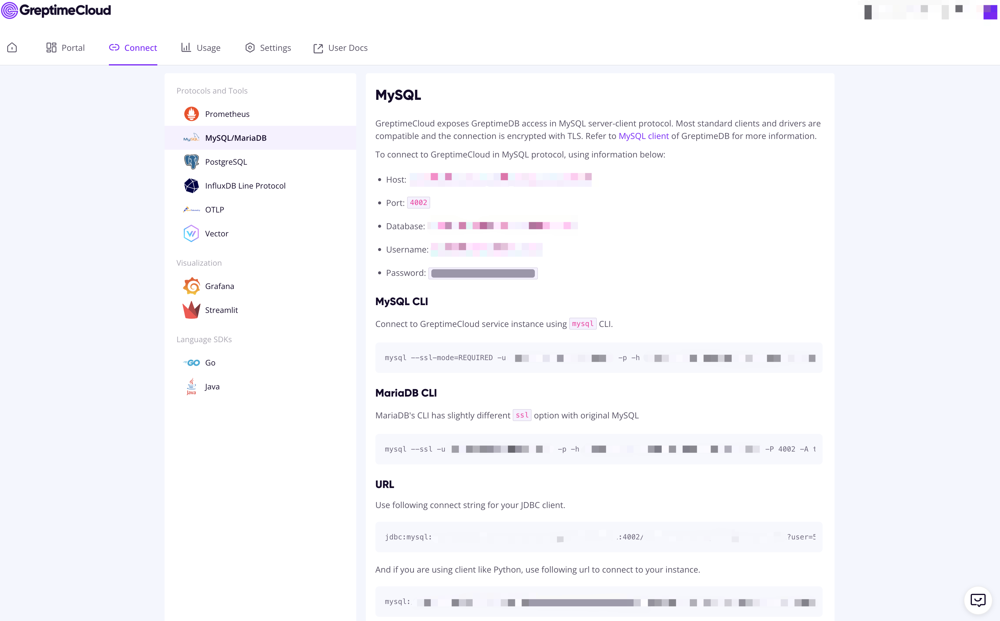
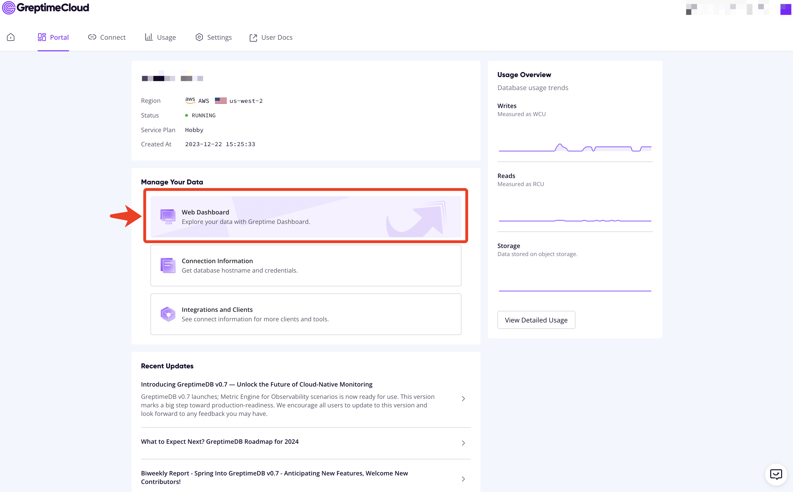
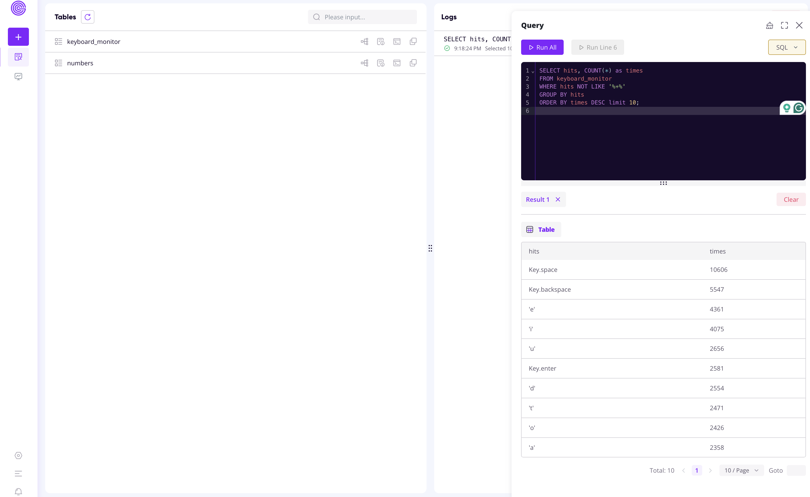

# Keyboard Monitor

## Step 1: Install requirements

```shell
pip3 install -r requirements.txt
```

## Step 2: Set up Greptime service

1. Obtain a free Greptime service from [GreptimeCloud](https://console.greptime.cloud/). 
2. Go to the "Connect" tab and find the connection string.
3. Copy `.env.example` to `.env` and set the connection string.



## Step 3: Start keyboard monitor

Run the agent script to listening keyboard inputs:

```shell
python3 agent.py
```

You should see logs like:

```
2024-03-07 20:57:53,799 INFO listener_thread Listening...
2024-03-07 20:58:01,510 INFO sender_thread sent: Key.backspace
2024-03-07 20:58:01,947 INFO sender_thread sent: Key.enter
2024-03-07 20:58:02,498 INFO sender_thread sent: Key.shift+'#'
2024-03-07 20:58:02,938 INFO sender_thread sent: Key.space
2024-03-07 20:58:03,377 INFO sender_thread sent: Key.cmd+Key.right
2024-03-07 20:58:04,052 INFO sender_thread sent: Key.cmd+'s'
...
```

## Step 4: Query keyboard inputs statistics

The following sample queries are executed from the Web Dashboard.





### Found the most frequent keys

```sql
SELECT hits, COUNT(*) as times
FROM keyboard_monitor
WHERE hits NOT LIKE '%+%'
GROUP BY hits
ORDER BY times DESC limit 10;
```

### Found the most frequent combos

```sql
SELECT hits, COUNT(*) as times
FROM keyboard_monitor
WHERE hits LIKE '%+%'
GROUP BY hits
ORDER BY times DESC limit 10;
```

### Calculate hits per minute

Read more about GreptimeDB's powerful [RANGE QUERY](https://docs.greptime.com/reference/sql/range).

```sql
SELECT
    ts,
    COUNT(1) RANGE '1h' FILL NULL as times
FROM keyboard_monitor ALIGN '1h'
ORDER BY ts DESC
LIMIT 10;
```

## Bonus: Visualization

* [ ] GreptimeCloud Dashboard
* [ ] Grafana
* [ ] Preset
