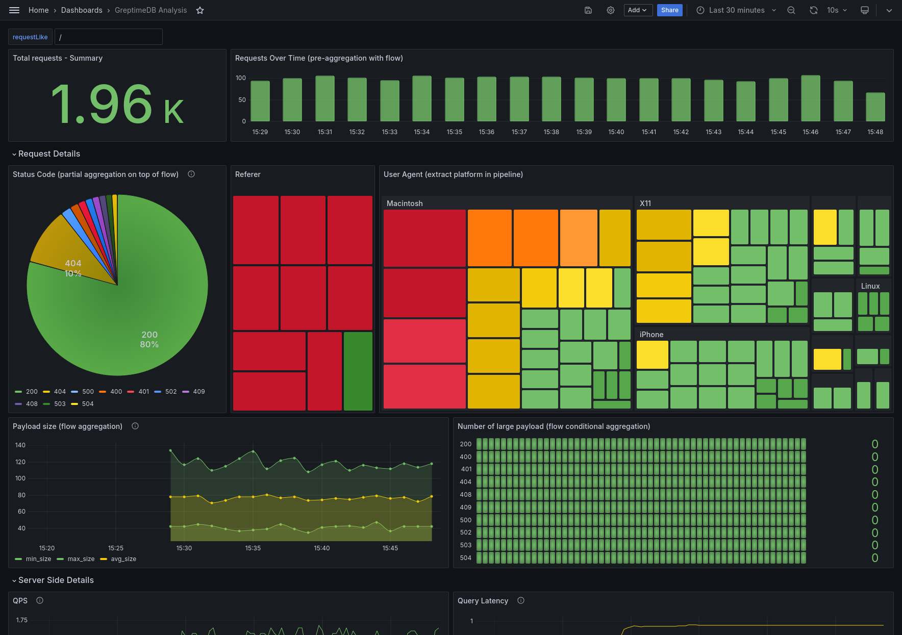
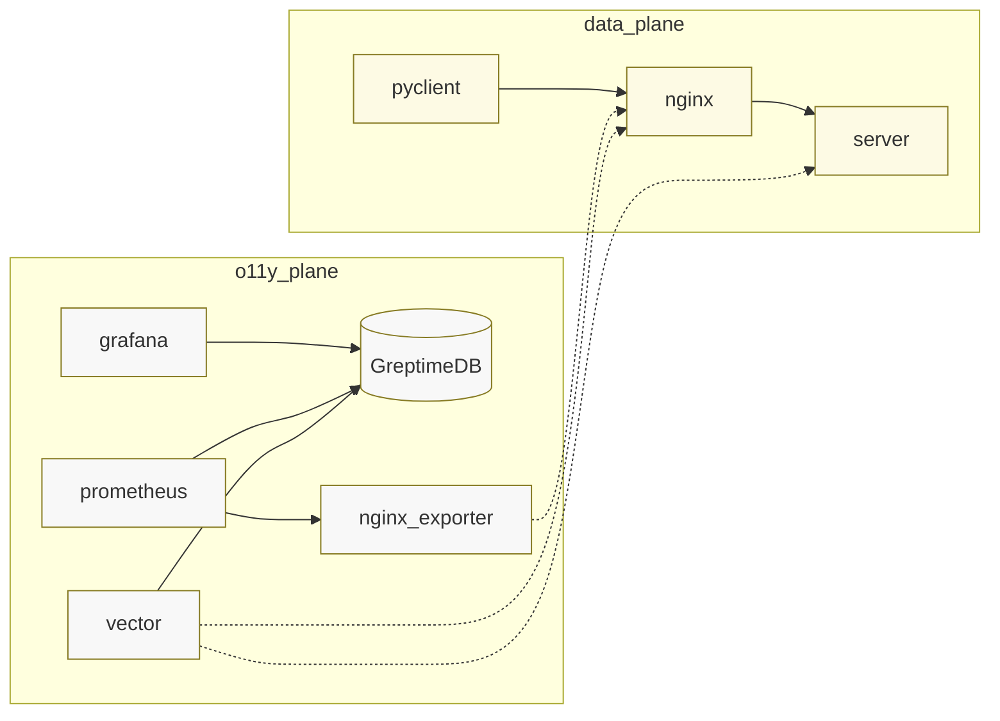

# The Nginx Observability Demo for GreptimeDB

This is a demo for [GreptimeDB](https://github.com/greptimeteam/greptimedb) that
takes Nginx Observability as an example. We have following features covered:

- Using GreptimeDB as **a scalable Prometheus backend** for Nginx metrics
- Using GreptimeDB to **parse and store structured events** from Nginx access
  logs and Python server logs
- Generating metrics from the Nginx access log using GreptimeDB's **continuous
  aggregation**
- Running **a single joined query** from both metrics and events
- Visualizing everything above from Grafana
  - Treemap to show the user-agent corresponding platform that is extracted
    in pipeline
  - Log details of the newest 50 nginx access log
  - Two time-series panels show flow continuous aggregation and conditional
    aggregation
  - Table shows the top 10 slow trace IDs
  - Joined log details show top 10 slow logs based on provided search strings
    to trace ID. Both Nginx and server-side details are included.



## How to run this demo

Ensure you have `git`, `docker` and `docker-compose` installed. To run this
demo:

```shell
git clone https://github.com/GreptimeTeam/demo-scene.git
cd demo-scene/nginx-log-metrics
docker compose up
```

It can take a while for the first run to pull down images and also build
necessary components.

Once it's up and running, open your browser at `http://localhost:3000` and
log in with the default username and password (both `admin`). Check the pre-built dashboards.

You can also access GreptimeDB if you have `mysql` installed. Just run
`mysql -h 127.0.0.1 -P 4002` to connect to the database and use SQL query
like `SHOW TABLES` as a start.

## How it works

This demo simulates a typical setup of a python based web application.

The data plane includes:

- A Python web application
- Nginx
- A web client generates random traffic

The observability plane includes:

- GreptimeDB, of course, as the storage of all data
- Vector, Prometheus, and its exporter for moving logs and metrics to
  GreptimeDB
- Grafana for dashboarding
- Some one-shot containers for initialization

The topology is illustrated in this diagram. One-shot containers are ignored.



All of those logs and metrics are stored in GreptimeDB, with the following:

- A pipeline to fashioning the Nginx access log. The config file is at
  [greptime_pipeline.yaml](./config_data/greptime_pipeline.yaml)
  - string decomposition, field parsing or renaming, etc. can be defined in
    pipeline process the semi-structured log
  - regex match and remapping
- A continuous aggregation over metrics. The config file is at
  [init_database.sql](./config_data/init_database.sql)
  - we can do other aggregation on top of partial-aggregated data to accelerate
    the query performance
  - we can treat the aggregated data as down-sampled data and store it for
    longer retention
  - we can do conditional aggregation based on some columns

## Help

1. If you modified a component like `vector` in this setup, remember to add
   `--build <container_name>` to your `docker compose up` to trigger a rebuild.
2. If you are behind a proxy, add `--build-args <proxy-url>` to `docker compose build`
   for a complete build.

Feel free to add an issue if you have any questions about this demo.
