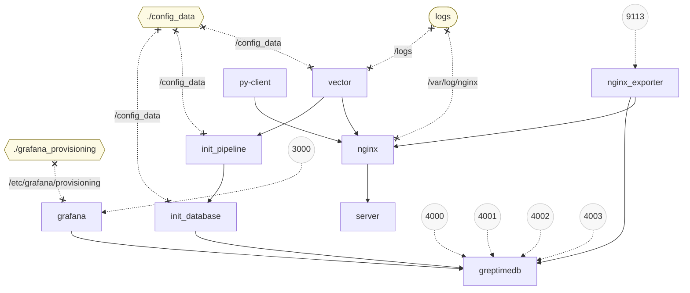

# Nginx log metrics demo

## Quick Start

Build and start with proxy:

```shell
docker compose build --build-arg https_proxy=http://172.17.0.1:7890
docker compose up -d --force-recreate
```

## Structure

<!-- This chart is generated by https://derlin.github.io/docker-compose-viz-mermaid/ -->



## Components

This demo will start a nginx in front of a python server, and use a client to request the nginx.

In this system, we have configured the following observability components:
- nginx-export to collect and export basic metrics from nginx
- vector to collect and push nginx access log
- prometheus to scrape metrics from python server and nginx
- python server send its logs direct to GreptimeDB

All of those logs and metrics are stored in GreptimeDB, with:
- a pipeline to fashioning the nginx access log. The config file is at [greptime_pipeline.yaml](./config_data/greptime_pipeline.yaml)
  - string decomposition, field parsing or renaming etc can be defined in pipeline process the semi-structured log
  - regex match and remapping
- a flow to continuous aggregate the metrics. The config file is at [init_database.sql](./config_data/init_database.sql)
  - we can do other aggregation on top of partial-aggregated data to accelerate the query performance
  - we can treat the aggregated data as down-sampled data and store it for longer retention
  - we can do conditional aggregation based on some columns

And the data are visualized in Grafana, which is available at [http://localhost:3000](http://localhost:3000) with default username and password as `admin`.

Beside several basic panels, it also has
- a tree map to show the user-agent corresponding platform that is extracted in pipeline
- a log details of newest 50 nginx access log
- two time-series panels shows flow continuous aggregation and conditional aggregation
- a table shows top 10 slow trace IDs
- a joined log details shows top 10 slow logs based on provided search strings to trace ID. Both nginx and server sides details are included.
