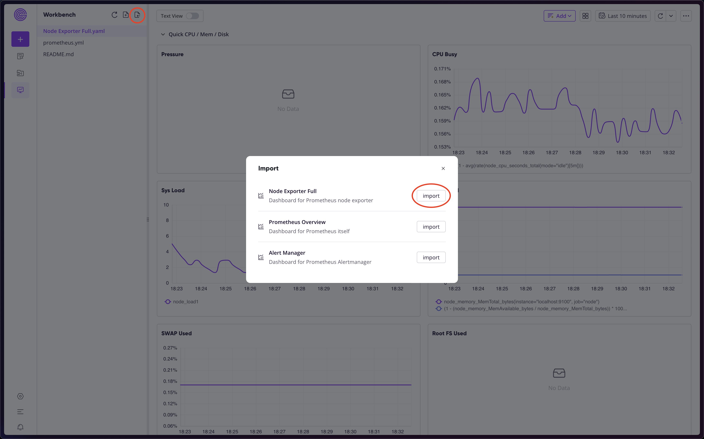
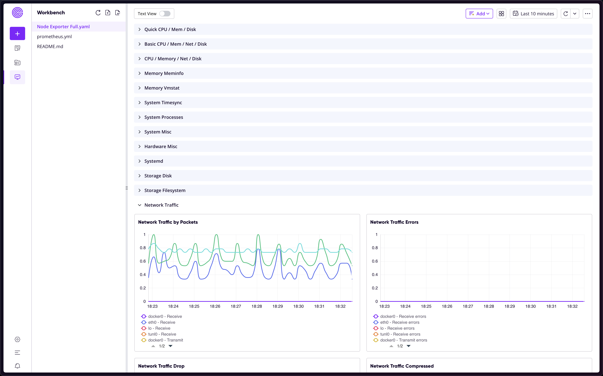
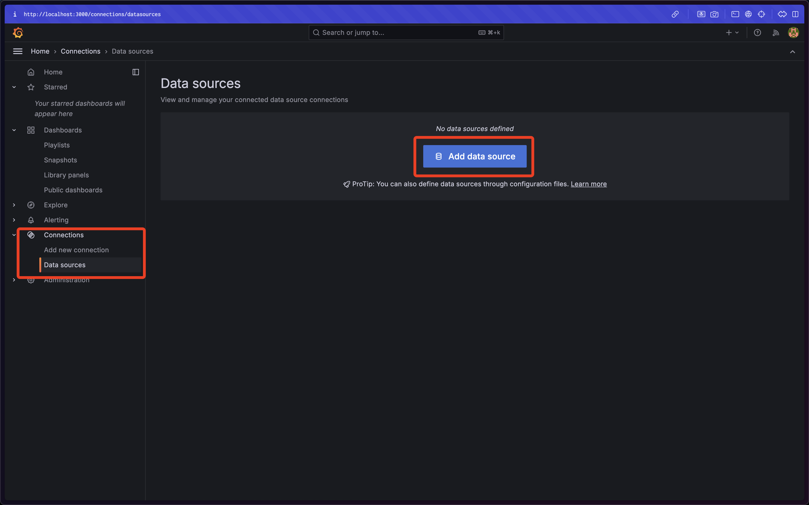
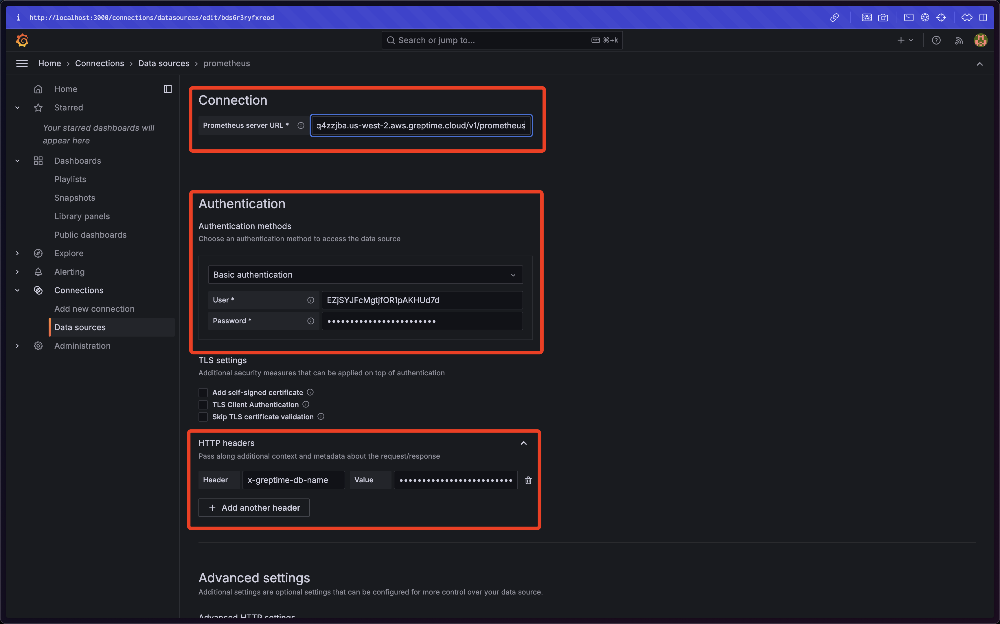
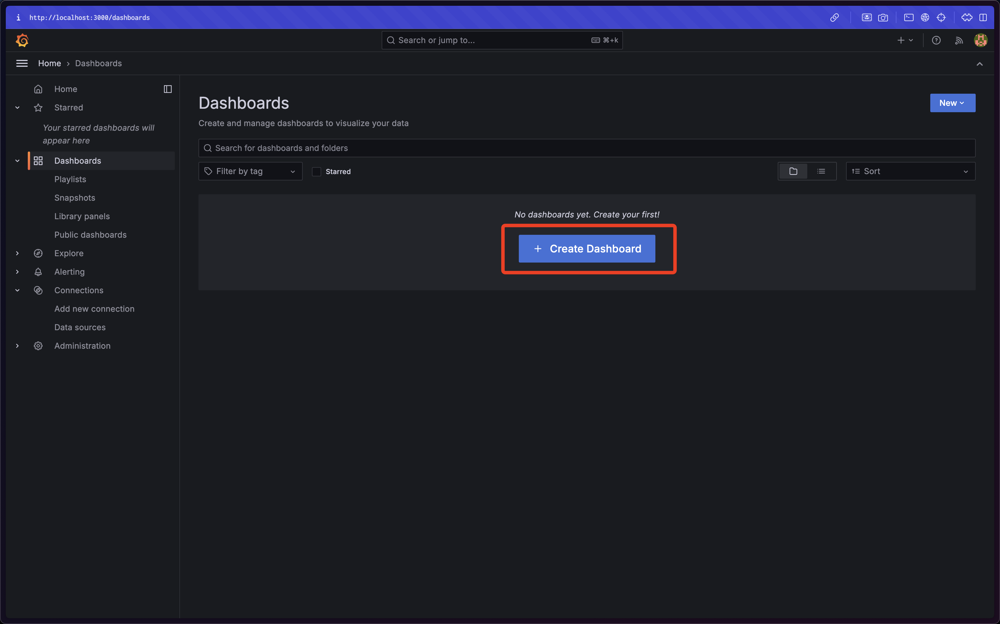
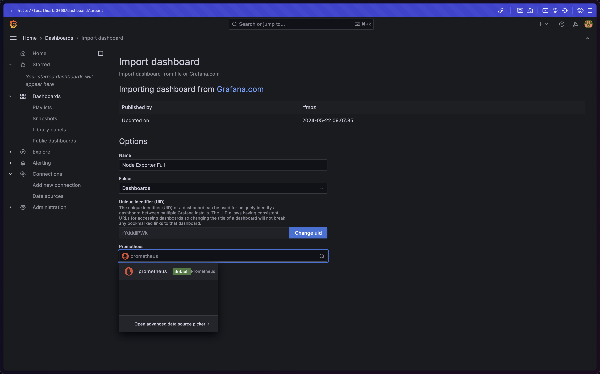
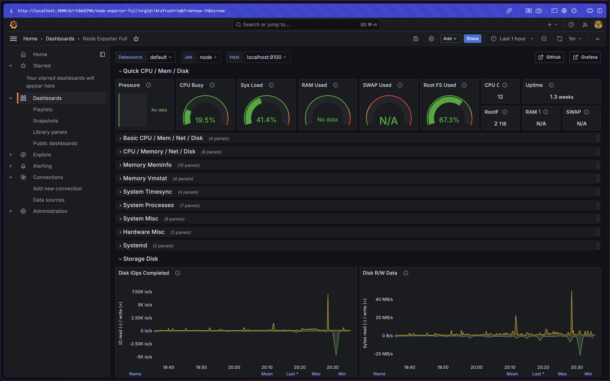

# Use GreptimeDB to store and visualize data from Node Exporter

## Rationales

GreptimeDB implements APIs for both Prometheus remote read and remote write. You can [use GreptimeDB as a Prometheus backend](https://docs.greptime.com/user-guide/ingest-data/for-observerbility/prometheus).

Meanwhile, GreptimeDB [supports PromQL](https://docs.greptime.com/user-guide/query-data/promql) as its query interface, so that you can use GreptimeDB as a drop-in replacement for Prometheus.

This demo showcases how to run the famous Node Exporter integrations with GreptimeDB as the storage backend.

## Step 1: Set up GreptimeDB service

First of all, let's get a free GreptimeDB service:

1. Obtain a free GreptimeDB service from [GreptimeCloud](https://console.greptime.cloud/).
2. Click the "Connection Information" button and find the connection string.
3. Export the necessary environment variables:

```shell
export GREPTIME_HOST="<host>"
```

```shell
export GREPTIME_DATABASE="<dbname>"
```

```shell
export GREPTIME_USERNAME="<username>"
```

```shell
export GREPTIME_PASSWORD="<password>"
```


## Step 2: Start the Node Exporter

Node Exporter is a Prometheus exporter for hardware and OS metrics exposed by Linus or Darwin kernels.

You can download and run the Node Exporter from its [release page](https://github.com/prometheus/node_exporter/releases). For example, run the following command if your system is `darwin-arm64`:

```bash
curl -fsSL -O https://github.com/prometheus/node_exporter/releases/download/v1.8.2/node_exporter-1.8.2.darwin-arm64.tar.gz
tar -xvzf node_exporter-1.8.2.darwin-arm64.tar.gz
cd node_exporter-1.8.2.darwin-arm64
./node_exporter
```

The Node Exporter should print several INFO logs:

```
...
ts=2024-07-19T01:46:25.629Z caller=node_exporter.go:111 level=info msg="Enabled collectors"
ts=2024-07-19T01:46:25.629Z caller=node_exporter.go:118 level=info collector=boottime
ts=2024-07-19T01:46:25.629Z caller=node_exporter.go:118 level=info collector=cpu
ts=2024-07-19T01:46:25.629Z caller=node_exporter.go:118 level=info collector=diskstats
ts=2024-07-19T01:46:25.629Z caller=node_exporter.go:118 level=info collector=filesystem
ts=2024-07-19T01:46:25.629Z caller=node_exporter.go:118 level=info collector=loadavg
ts=2024-07-19T01:46:25.629Z caller=node_exporter.go:118 level=info collector=meminfo
ts=2024-07-19T01:46:25.629Z caller=node_exporter.go:118 level=info collector=netdev
ts=2024-07-19T01:46:25.629Z caller=node_exporter.go:118 level=info collector=os
ts=2024-07-19T01:46:25.629Z caller=node_exporter.go:118 level=info collector=powersupplyclass
ts=2024-07-19T01:46:25.629Z caller=node_exporter.go:118 level=info collector=textfile
ts=2024-07-19T01:46:25.629Z caller=node_exporter.go:118 level=info collector=thermal
ts=2024-07-19T01:46:25.629Z caller=node_exporter.go:118 level=info collector=time
ts=2024-07-19T01:46:25.629Z caller=node_exporter.go:118 level=info collector=uname
ts=2024-07-19T01:46:25.629Z caller=tls_config.go:313 level=info msg="Listening on" address=[::]:9100
ts=2024-07-19T01:46:25.629Z caller=tls_config.go:316 level=info msg="TLS is disabled." http2=false address=[::]:9100
...
```

Now, you can get the current hardware and OS metrics with:

```bash
curl http://localhost:9100/metrics
```

## Step 3: Scrape Metrics and Push to GreptimeDB

As shown above, the Node Exporter only exposes an endpoint that you can query the current metrics. To scrape these metrics and push them to the GreptimeDB service, you can either:

1. Start up a Prometheus instance on localhost that's configured to scrape metrics from the running Node Exporter, and remotely write to the GreptimeDB service; or,
2. If the Node Exporter endpoint can be accessed from publish network, you can open the Web Dashboard of the GreptimeDB service, head to the Workbench tab (`https://<host>.greptime.cloud/dashboard/workbench`), and modify the `prometheus.yml` file to add the config as described below.

Since the Node Exporter started above is running on localhost, this demo chooses the first option.

You can download and run a Prometheus instance from its [release page](https://github.com/prometheus/prometheus/releases). For example, run the following command if your system is `darwin-arm64`:

```bash
curl -fsSL -O https://github.com/prometheus/prometheus/releases/download/v2.53.1/prometheus-2.53.1.darwin-arm64.tar.gz
tar -xvzf prometheus-2.53.1.darwin-arm64.tar.gz
cd prometheus-2.53.1.darwin-arm64
```

Modify the `prometheus.yml` file with:

> [!TIP]
>
> If you switch to a new session, you need to re-export the environment variables as in [Step 1](#step-1-set-up-greptimedb-service).

```bash
cat <<END > prometheus.yml
global:
  scrape_interval: 15s
scrape_configs:
  - job_name: "node"
    static_configs:
      - targets: ["localhost:9100"]
remote_write:
  - url: "https://${GREPTIME_HOST}/v1/prometheus/write?db=${GREPTIME_DATABASE}"
    basic_auth:
      username: ${GREPTIME_USERNAME}
      password: ${GREPTIME_PASSWORD}
END
```

Start the bridge instance with:

```bash
./prometheus --config.file=./prometheus.yml
```

## Step 4: Visualize on GreptimeDB Dashboard

You can visualize the node mertics from the Web Dashboard:




The "Node Exporter Full" dashboard template will give you the same charts as the Grafana Node Exporter Dashboard.



## Bonus: Visualize with Grafana Dashboard

Since GreptimeDB can be used as a drop-in replacement of Prometheus, it's also possible to visualize node metrics with Grafana Dashboard with the Prometheus plugin, as if GreptimeDB is a Prometheus instance.

First, start a Grafana container:

```bash
docker run -d --name=grafana -p 3000:3000 grafana/grafana
```

Open `http://localhost:3000/` at browser and log in with the default credential: both username and password are `admin`.

You should add GreptimeDB as an instance of Prometheus data source. Click "Connections", "Data sources", and then "Add new data source":



Choose "Prometheus" and add the necessary configuration:



Click "Save & Test" at the button to ensure the connection is correctly set up.

Then, go the "Dashboard" page and click "Create Dashboard":



Choose "Import a dashboard" and then load the Node Exporter Full public template (`https://grafana.com/grafana/dashboards/1860-node-exporter-full/`):



Use the data source you just registered, and click "Import". You will be redirected to the final dashboard:



## Bonus: Bootstrap with a Docker Compose oneliner

This demo also provides a [docker-compose.yml](docker-compose.yml) file so that you can set up the whole Node Exporter integration in one line:

Create your own `prometheus.yml` from `prometheus.yml.tpl` by replacing
placeholders with your GreptimeDB connection information. Start Prometheus/Node
Exporter/Grafana with docker compose:

```bash
docker compose up
```
