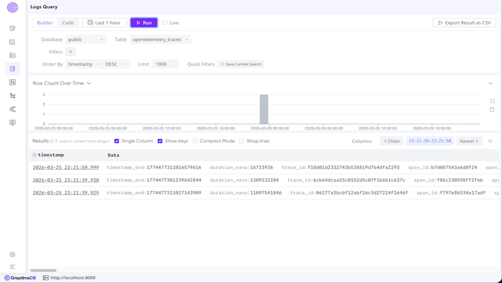
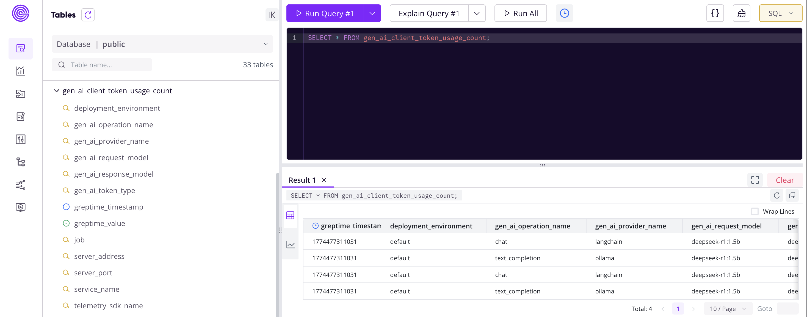

# OpenTelemetry + GreptimeDB for AI Application Observability

## Prerequisites

Ensure you have installed `git`, `docker` and `docker-compose` 22.4 or newer.

## Step 1: Start All Services

All services are managed by Docker Compose. Start GreptimeDB, the OpenTelemetry
Collector, and Ollama with a single command:
```bash
docker-compose up -d
```

This will start the following containers:

| Service          | Role                                              |
|------------------|---------------------------------------------------|
| `ollama`         | Serves the LLM via a local REST API               |
| `greptimedb`     | Stores metrics, logs, and traces                  |
| `otel-collector` | Receives telemetry and forwards it to GreptimeDB  |

## Step 2: Pull the DeepSeek R1 Model

Once the containers are running, pull the DeepSeek R1 1.5b model into Ollama:
```bash
docker exec my-ollama ollama pull deepseek-r1:1.5b
```

> We use DeepSeek R1 1.5b as it works well on older hardware.

To verify Ollama is working correctly, send a test request:
```bash
curl http://localhost:11434/api/chat -d '{
  "model": "deepseek-r1:1.5b",
  "messages": [{ "role": "user", "content": "why is the sky blue?" }],
  "stream": false
}'
```

A successful JSON response confirms that Ollama and DeepSeek R1 1.5b are ready.

## Step 3: Verify GreptimeDB & OpenTelemetry Collector

Access the GreptimeDB dashboard to confirm it is running:
[http://localhost:4000/dashboard/](http://localhost:4000/dashboard/)

The OpenTelemetry Collector exports metrics, logs, and traces to GreptimeDB.
Here's the relevant configuration (`otel-collector-config.yaml`):
```yaml
exporters:
  otlphttp:
    endpoint: http://greptimedb:4000/v1/otlp
    tls:
      insecure: true

service:
  extensions: [health_check]
  pipelines:
    traces:
      receivers: [otlp]
      exporters: [debug, otlphttp]
    metrics:
      receivers: [otlp]
      exporters: [debug, otlphttp]
    logs:
      receivers: [otlp]
      exporters: [debug, otlphttp]
```

## Step 4: Run the LLM Demo

Run the joke app as a one-off container on the same Docker network:
```bash
docker-compose run --rm llm-joke-app
```

The container will build automatically from the existing `Dockerfile`, execute
`joke.py`, print a joke to the terminal, then exit and clean itself up.

The core logic in `joke.py` is straightforward:
```python
import openlit
from langchain_ollama.llms import OllamaLLM

openlit.init(otlp_endpoint="http://otel-collector:4318", disable_batch=True)
llm = OllamaLLM(model="deepseek-r1:1.5b", base_url="http://ollama:11434")
print(llm.invoke("Tell me a joke"))
```

> **Note:** The `otlp_endpoint` points to `otel-collector` (the service name),
> not `127.0.0.1`, because all containers share the same Docker network.

## Step 5: Data Visualization Using GreptimeDB Dashboard

Access the GreptimeDB Dashboard's log view to examine trace data: [http://localhost:4000/dashboard/log-query#/dashboard/log-query](http://localhost:4000/dashboard/log-query#/dashboard/log-query)



Check the token usage using SQL:
```sql
SELECT * FROM gen_ai_client_token_usage_count;
```

The output will look similar to:


For advanced visualization, you can use Grafana with GreptimeDB. GreptimeDB supports both MySQL and Prometheus data sources in Grafana and provides its own data source plugin. For more information, see the [GreptimeDB Grafana documentation](https://docs.greptime.com/user-guide/integrations/grafana/).
