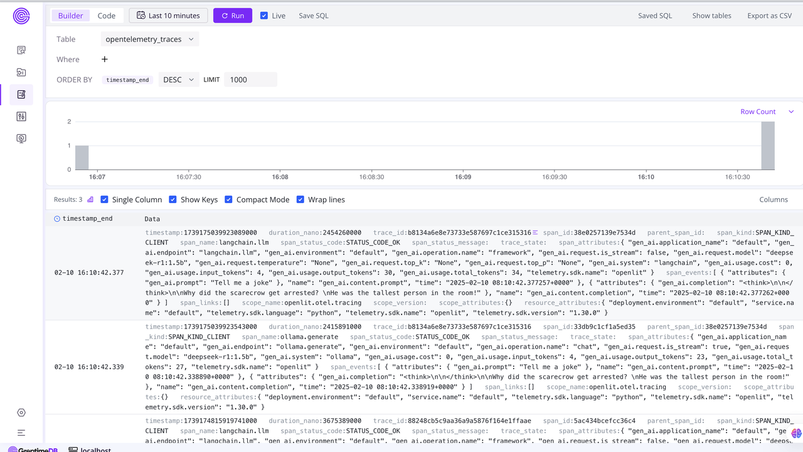
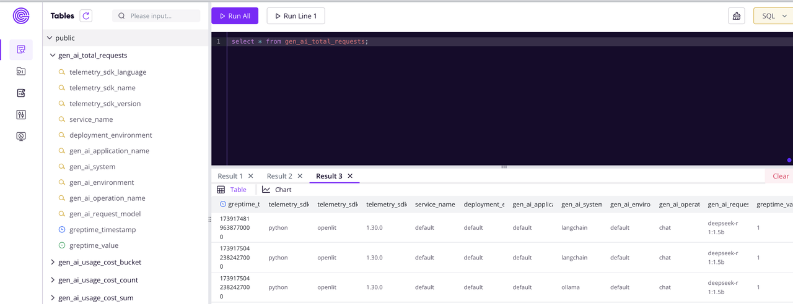

# OpenTelemetry + GreptimeDB for AI Application Observability

## Step 1: Install Ollama & DeepSeek R1 Model

You can download the appropriate installation package for your operating system from the [Ollama official website](https://ollama.com/download). On Mac systems, you can easily install it using Homebrew:
```bash
brew install ollama
```

Open a terminal and verify that Ollama is correctly installed:
```bash
ollama --version
```

The installed version used in this guide is 0.5.7:
```bash
ollama version is 0.5.7
```

Run the Ollama executable:
```bash
ollama serve
```

Next, let's pull and run the DeepSeek model. We'll use DeepSeek R1 1.5b as it works well on older hardware:
```bash
ollama run deepseek-r1:1.5b
```

If your network connection is stable and the model downloads successfully, you'll enter the Ollama-LLM interaction interface:
```bash
$ ollama run deepseek-r1:1.5b
>>> /?
Available Commands:
  /set            Set session variables
  /show           Show model information
  /load <model>   Load a session or model
  /save <model>   Save your current session
  /clear          Clear session context
  /bye            Exit
  /?, /help       Help for a command
  /? shortcuts    Help for keyboard shortcuts

Use """ to begin a multi-line message.
```

This indicates successful configuration of the Ollama framework with the DeepSeek R1 1.5b model.

To test the setup, let's ask DeepSeek a question:
```bash
curl http://localhost:11434/api/chat -d '{
  "model": "deepseek-r1:1.5b",
  "messages": [
    {
      "role": "user",
      "content": "why is the sky blue?"
    }
  ],
  "stream": false
}'
```

## Step 2: Setup and Start GreptimeDB & OpenTelemetry Collector

Run `docker-compose up` to start GreptimeDB and the OpenTelemetry Collector.

The OpenTelemetry collector will export metrics, logs, and traces to GreptimeDB.
Here's the configuration (`otel-collector-config.yaml`):
```yaml
  otlphttp:
    endpoint: http://greptimedb:4000/v1/otlp
    tls:
      insecure: true
  ...
  service:
    extensions: [health_check]
    pipelines:
      traces:
        receivers: [otlp]
        exporters: [debug,otlphttp]
      metrics:
        receivers: [otlp]
        exporters: [debug,otlphttp]
      logs:
        receivers: [otlp]
        exporters: [debug,otlphttp]
```

Verify the setup by accessing the GreptimeDB dashboard at [http://localhost:4000/dashboard/](http://localhost:4000/dashboard/).

## Step 3: Run the LLM Demo

Install the required Python dependencies by [uv](https://github.com/astral-sh/uv):
```bash
uv venv
source .venv/bin/activate
uv pip install -r requirements.txt
```

Run the `joke.py` script:
```bash
uv run joke.py
```

This script uses DeepSeek to generate a joke:
```python
import openlit
from langchain_ollama.llms import OllamaLLM

openlit.init(otlp_endpoint="http://127.0.0.1:4318", disable_batch=True)
llm = OllamaLLM(model='deepseek-r1:1.5b')
print(llm.invoke("Tell me a joke"))
```

## Step 4: Data Visualization Using GreptimeDB Dashboard

Access the GreptimeDB Dashboard's log view to examine trace data: [http://localhost:4000/dashboard/log-query#/dashboard/log-query](http://localhost:4000/dashboard/log-query#/dashboard/log-query)



Check the total number of requests using SQL:
```sql
SELECT * FROM gen_ai_total_requests;
```

The output will look similar to:


For advanced visualization, you can use Grafana with GreptimeDB. GreptimeDB supports both MySQL and Prometheus data sources in Grafana and provides its own data source plugin. For more information, see the [GreptimeDB Grafana documentation](https://docs.greptime.com/user-guide/integrations/grafana/).
