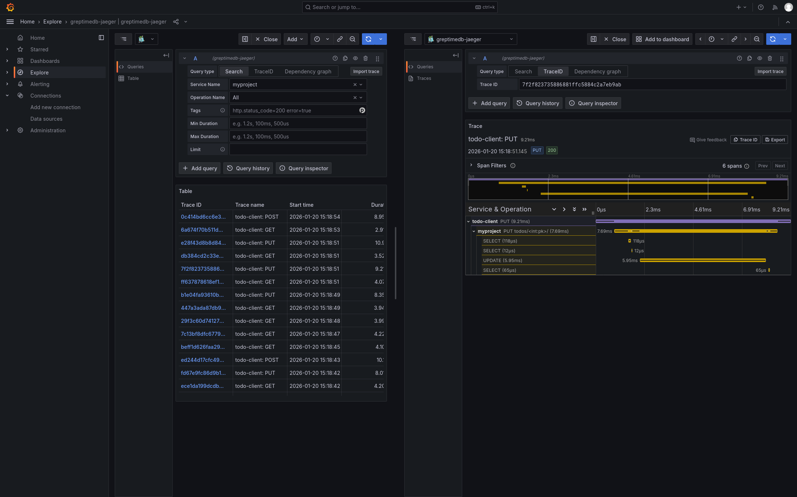
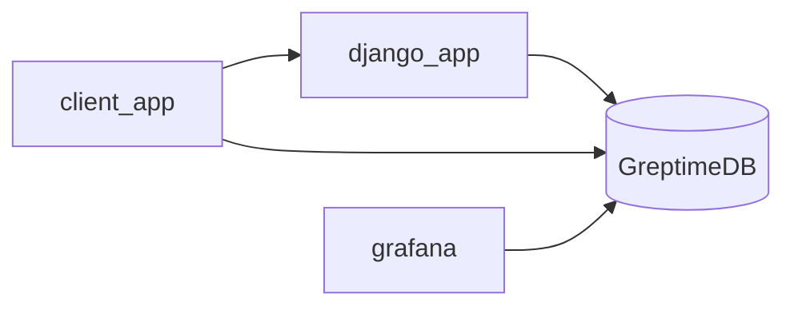

# Wide events, OpenTelemetry with GreptimeDB

This docker-compose file demos how single-source truth, observability
2.0 will work with GreptimeDB.

The demo uses OpenTelemetry SDKs to instrument a Django application
and sends observability data to GreptimeDB. Here we use Otel Trace
SDKs because it's well instrumented. However, in Observability 2.0, we
treat the spans as events and don't require it to be in trace or log
format.

## How to run this demo

Ensure you have `git`, `docker`, `docker-compose` and `psql` client
installed. Docker Compose version 2.24 or higher is required. To run this
demo:

```shell
git clone https://github.com/GreptimeTeam/demo-scene.git
cd demo-scene/opentelemetry-trace-django
docker compose up
```

You can access GreptimeDB using `psql` client. Just run `psql -h 127.0.0.1 -p
4003 -d public` to connect to the database and use `\d` for a list of tables.

```
psql (17.7, server 16.3-greptimedb-1.0.0-beta.4)
Type "help" for help.

public=> \d
                    List of relations
 Schema |            Name             | Type  |  Owner
--------+-----------------------------+-------+----------
 public | django_http_request_latency | table | postgres
 public | web_trace_demo              | table | postgres
 public | web_trace_demo_operations   | table | postgres
 public | web_trace_demo_services     | table | postgres
(4 rows)
```

### Access derived metrics

We created an example to generate django p99 latency as event data ingested. To
access the generated data, use SQL query like this:

```sql
SELECT
    span_name,
    time_window,
    uddsketch_calc(0.90, "latency_sketch") AS p90
FROM
    django_http_request_latency
ORDER BY
    time_window DESC
LIMIT 100;
```

### Visualizing Traces from Grafana

We already have grafana instance included in this demo. Visit
`http://127.0.0.1:3000` for the grafana UI. Use default username and password
`admin`, `admin` to login.

From the Explorer section, we can query traces using GreptimeDB's Jaeger
compatible API.



We can also run SQL queries from Grafana using the greptimedb-pg data source.

## How it works

The topology is illustrated in this diagram.


