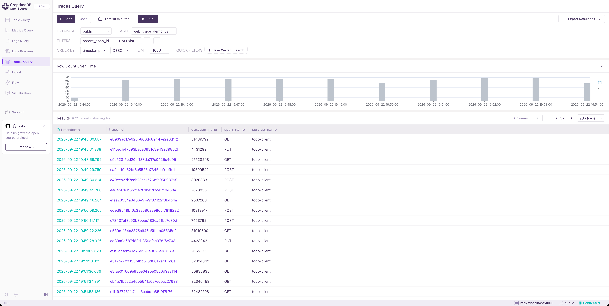
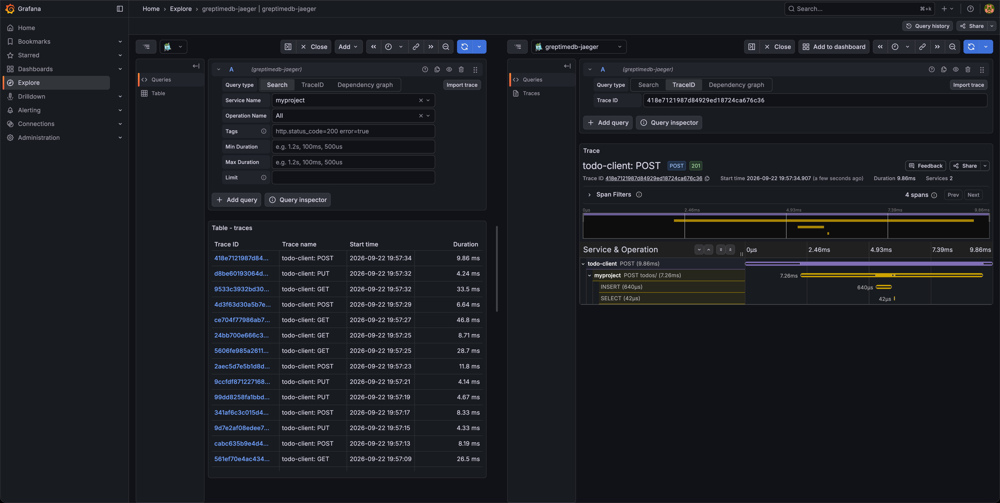
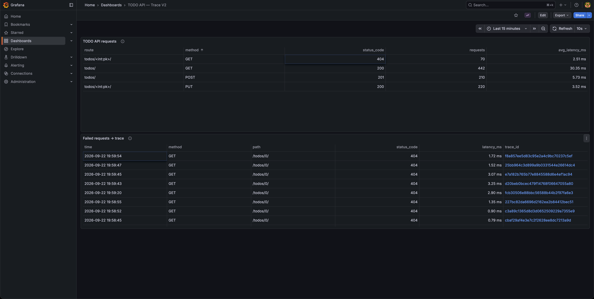
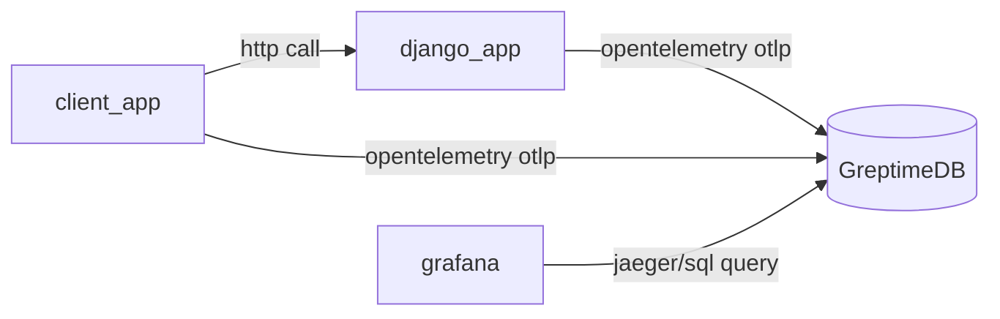

# Wide events, OpenTelemetry with GreptimeDB

This docker-compose file demos how single-source truth, observability
2.0 will work with GreptimeDB.

The demo uses OpenTelemetry SDKs to instrument a Django application
and sends observability data to GreptimeDB. Here we use Otel Trace
SDKs because it's well instrumented. However, in Observability 2.0, we
treat the spans as events and don't require it to be in trace or log
format.

The demo uses the `greptime_trace_v2` pipeline.

Span, scope, and resource attributes are stored in JSON2 columns.
The fixed span columns still support the latency Flow below,
and Grafana queries traces through the Jaeger-compatible API.

Traces are written to a new `web_trace_demo_v2` table, created automatically
on ingestion. Existing V1 tables cannot accept V2 writes and are left untouched.

## How to run this demo

Ensure you have `git`, `docker`, `docker-compose` and `psql` client
installed. Docker Compose version 2.24 or higher is required. To run this
demo:

```shell
git clone https://github.com/GreptimeTeam/demo-scene.git
cd demo-scene/opentelemetry-trace-django
docker compose up
```

You can access GreptimeDB using `psql` client. Just run `psql -h 127.0.0.1 -p
4003 -d public` to connect to the database and use `\d` for a list of tables.

```
public=> \d
                    List of relations
 Schema |             Name             | Type  |  Owner
--------+------------------------------+-------+----------
 public | django_http_request_latency  | table | postgres
 public | web_trace_demo_v2            | table | postgres
 public | web_trace_demo_v2_operations | table | postgres
 public | web_trace_demo_v2_services   | table | postgres
(4 rows)
```

### Access derived metrics

We created an example to generate Django p90 latency as event data ingested. To
access the generated data, use SQL query like this:

```sql
SELECT
    span_name,
    time_window,
    uddsketch_calc(0.90, "latency_sketch") AS p90
FROM
    django_http_request_latency
ORDER BY
    time_window DESC
LIMIT 100;
```

### Visualization from Greptime Dashboard

Visit `http://127.0.0.1:4000/dashboard` for the trace visualization.



### Visualizing Traces from Grafana

We already have grafana instance included in this demo. Visit
`http://127.0.0.1:3000` for the grafana UI. Use default username and password
`admin`, `admin` to login.

From the Explorer section, we can query traces using GreptimeDB's Jaeger
compatible API.



We can also run SQL queries from Grafana using the greptimedb-pg data source.

### TODO API analysis → investigate a failed request

This scenario follows an API investigation from an overview of HTTP responses
to an individual failed request. It demonstrates reading, casting, grouping,
and filtering JSON2 attributes, then using the same span's `trace_id` to inspect
the full call chain. No additional application instrumentation is needed.

Open the provisioned [TODO API — Trace V2 dashboard](http://127.0.0.1:3000/d/todo-api-trace-v2).
It refreshes every 10 seconds and initially shows the last 15 minutes.

1. The traffic client requests `/todos/0/` in about 10% of its actions.
   Auto-generated TODO IDs start at 1, so these requests deliberately return 404.
2. **TODO API requests** groups requests by route, method, and status code,
   with request counts and average latency. Look for the GET/404 row.
3. **Failed requests → trace** lists the latest 100 responses with status >= 400.
   Click a `trace_id`, then **View trace**, to open that request in Grafana Explore
   using the Jaeger data source. Inspect the client HTTP, Django, and SQLite spans.



Expect successful GET/200, POST/201, and PUT/200 requests alongside GET/404
requests for the `todos/<int:pk>/` route. The failed-request list shows the
concrete path `/todos/0/`; its trace shows the database lookup and the HTTP 404
response. Allow a short time for automatic traffic and span export if the
panels are initially empty.

Both panels read HTTP attributes directly from the Trace V2 `span_attributes`
JSON2 column. Double quotes preserve dots in attribute names; casts produce
SQL strings or numbers. A 404 need not mark the Django server span as ERROR,
so the failed-request query filters the HTTP status code explicitly.

The attributes in this demo are mostly flat key-value pairs because the Python
auto-instrumentation libraries follow OpenTelemetry's
[semantic naming conventions](https://opentelemetry.io/docs/specs/semconv/general/naming/).
Dots separate namespaces in an attribute name; they do not imply nested objects.
For example, the instrumentation sets `"http.response.status_code"` to `404`,
which Trace V2 stores in the JSON2 column as:

```json
{
  "http.request.method": "GET",
  "http.response.status_code": 404
}
```

GreptimeDB preserves these keys rather than expanding them into an `http`
object. Thus `span_attributes."http.response.status_code"::BIGINT` reads one
complete key. This scenario demonstrates querying JSON2 attributes, but does
not demonstrate nested-object traversal.

You can also run these queries in GreptimeDB's SQL editor:

```sql
SELECT
  span_attributes."http.route"::STRING AS route,
  span_attributes."http.request.method"::STRING AS method,
  span_attributes."http.response.status_code"::BIGINT AS status_code,
  COUNT(*) AS requests,
  AVG(duration_nano) / 1000000.0 AS avg_latency_ms
FROM web_trace_demo_v2
WHERE "timestamp" >= NOW() - INTERVAL '15 minutes'
  AND scope_name = 'opentelemetry.instrumentation.django'
GROUP BY route, method, status_code
ORDER BY status_code DESC, requests DESC;
```

```sql
SELECT
  "timestamp",
  span_attributes."http.request.method"::STRING AS method,
  span_attributes."url.path"::STRING AS path,
  span_attributes."http.response.status_code"::BIGINT AS status_code,
  duration_nano / 1000000.0 AS latency_ms,
  trace_id
FROM web_trace_demo_v2
WHERE "timestamp" >= NOW() - INTERVAL '15 minutes'
  AND scope_name = 'opentelemetry.instrumentation.django'
  AND span_attributes."http.response.status_code"::BIGINT >= 400
ORDER BY "timestamp" DESC
LIMIT 100;
```

The Grafana panels use `$__timeFilter("timestamp")` instead of the fixed SQL
window, so changing the dashboard time range applies to both panels.
The trace link uses Grafana's [Explore URL format](https://grafana.com/docs/grafana/latest/visualizations/explore/get-started-with-explore/#generate-explore-urls-from-external-tools).

To verify the scenario end to end, run `python3 smoke_test.py` with the demo
running. It generates a 404 with a unique trace ID, executes both dashboard
queries through Grafana, and verifies that the trace link resolves to spans.

## How it works

The topology is illustrated in this diagram.


```mermaid
flowchart LR
  greptimedb[(GreptimeDB)]
  django_app
  client_app
  grafana

  client_app --> |http call| django_app
  django_app --> |opentelemetry otlp| greptimedb
  client_app --> |opentelemetry otlp| greptimedb

  grafana --> |jaeger/sql query| greptimedb
```
