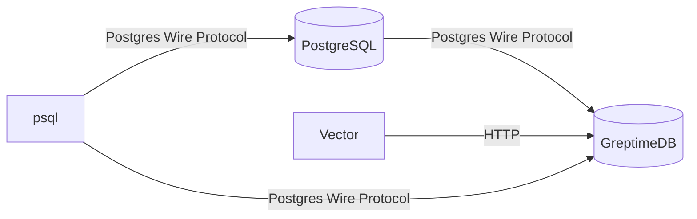

# GreptimeDB for Postgres_fdw

This docker-compose file demos how to configure GreptimeDB with Postgres foreign
data wrapper so that you can query GreptimeDB from vanilla Postgres.

This demo uses [Vector](https://vector.dev) as a data source to generate demo
logs and ingest into GreptimeDB with built-in GreptimeDB sink.

## How to run this demo

Ensure you have `git`, `docker`, `docker-compose` and `psql` client
installed. Docker Compose version 2.24 or higher is required. To run this
demo:

```shell
git clone https://github.com/GreptimeTeam/demo-scene.git
cd demo-scene/postgres-fdw
docker compose up
```

You can access GreptimeDB using `psql` client. Just run `psql -h 127.0.0.1 -p
4003 -d public` to connect to the database and check its content.

```
psql -h 127.0.0.1 -p 4003 -d public
psql (17.7, server 16.3-greptimedb-1.0.0-beta.2)
Type "help" for help.

public=> \dt
             List of relations
 Schema |      Name      | Type  |  Owner
--------+----------------+-------+----------
 public | demo_logs_json | table | postgres
(1 row)
```

Next, use `psql` to access vanilla postgres using `psql -h 127.0.0.1 -p 5432 -U
postgres`. You can check foreign servers and tables, query data from the remote
GreptimeDB.

```
psql -h 127.0.0.1 -p 5432 -U postgres
psql (16.5, server 17.2 (Debian 17.2-1.pgdg120+1))
WARNING: psql major version 16, server major version 17.
         Some psql features might not work.
Type "help" for help.

postgres=# \d
                   List of relations
 Schema |       Name        |     Type      |  Owner
--------+-------------------+---------------+----------
 public | ft_demo_logs_json | foreign table | postgres
(1 row)

postgres=# \des
           List of foreign servers
    Name    |  Owner   | Foreign-data wrapper
------------+----------+----------------------
 greptimedb | postgres | postgres_fdw
(1 row)

postgres=# SELECT count(*) FROM ft_demo_logs_json;
 count
-------
   754
(1 row)

postgres=# SELECT count(*) FROM ft_demo_logs_json WHERE method = 'GET';
 count
-------
   109
(1 row)

postgres=# SELECT * FROM ft_demo_logs_json WHERE method = 'GET' ORDER BY greptime_timestamp DESC LIMIT 10;
 bytes |       datetime       |      host      | method | protocol |                        referer                         |           request            | status | user-identifier |     greptime_timestamp
-------+----------------------+----------------+--------+----------+--------------------------------------------------------+------------------------------+--------+-----------------+----------------------------
 17367 | 13/Dec/2024:07:33:54 | 241.75.77.209  | GET    | HTTP/1.0 | https://up.nu/booper/bopper/mooper/mopper              | /wp-admin                    | 301    | BronzeGamer     | 2024-12-13 07:33:54.809142
  1214 | 13/Dec/2024:07:33:52 | 95.95.146.122  | GET    | HTTP/1.1 | https://for.florist/observability/metrics/production   | /booper/bopper/mooper/mopper | 301    | devankoshal     | 2024-12-13 07:33:52.809289
 16179 | 13/Dec/2024:07:33:50 | 218.254.51.147 | GET    | HTTP/1.0 | https://up.bradesco/wp-admin                           | /user/booperbot124           | 307    | ahmadajmi       | 2024-12-13 07:33:50.809062
 31284 | 13/Dec/2024:07:33:38 | 61.123.107.141 | GET    | HTTP/1.0 | https://random.author/observability/metrics/production | /secret-info/open-sesame     | 304    | jesseddy        | 2024-12-13 07:33:38.808307
  2048 | 13/Dec/2024:07:33:32 | 76.30.170.167  | GET    | HTTP/2.0 | https://for.toyota/observability/metrics/production    | /booper/bopper/mooper/mopper | 304    | BryanHorsey     | 2024-12-13 07:33:32.808714
 18429 | 13/Dec/2024:07:33:16 | 13.177.187.172 | GET    | HTTP/2.0 | https://we.ikano/apps/deploy                           | /booper/bopper/mooper/mopper | 501    | jesseddy        | 2024-12-13 07:33:16.808657
 43773 | 13/Dec/2024:07:33:07 | 39.238.42.248  | GET    | HTTP/1.0 | https://up.caravan/user/booperbot124                   | /do-not-access/needs-work    | 550    | benefritz       | 2024-12-13 07:33:08.809523
 26599 | 13/Dec/2024:07:33:04 | 68.55.2.213    | GET    | HTTP/2.0 | https://names.fyi/this/endpoint/prints/money           | /booper/bopper/mooper/mopper | 404    | shaneIxD        | 2024-12-13 07:33:04.808889
 38680 | 13/Dec/2024:07:32:57 | 101.219.74.21  | GET    | HTTP/1.0 | https://for.eu/do-not-access/needs-work                | /secret-info/open-sesame     | 400    | b0rnc0nfused    | 2024-12-13 07:32:58.809528
  3421 | 13/Dec/2024:07:32:56 | 68.52.17.154   | GET    | HTTP/2.0 | https://some.productions/this/endpoint/prints/money    | /apps/deploy                 | 400    | shaneIxD        | 2024-12-13 07:32:56.80887
(10 rows)

postgres=# SELECT
  DATE_TRUNC('minute', greptime_timestamp) AS minute_timestamp,
  method,
  COUNT(*) AS request_count
FROM  ft_demo_logs_json
WHERE greptime_timestamp IS NOT NULL
GROUP BY
  DATE_TRUNC('minute', greptime_timestamp),
  method
ORDER BY
  minute_timestamp DESC,
  method
LIMIT 10;
  minute_timestamp   | method | request_count
---------------------+--------+---------------
 2025-12-15 09:31:00 | DELETE |             8
 2025-12-15 09:31:00 | GET    |             5
 2025-12-15 09:31:00 | HEAD   |             6
 2025-12-15 09:31:00 | OPTION |             9
 2025-12-15 09:31:00 | PATCH  |            11
 2025-12-15 09:31:00 | POST   |             4
 2025-12-15 09:31:00 | PUT    |             3
 2025-12-15 09:30:00 | DELETE |            16
 2025-12-15 09:30:00 | GET    |             6
 2025-12-15 09:30:00 | HEAD   |             6
(10 rows)
```

## How it works

The topology is illustrated in this diagram.



To see how we can configure GreptimeDB for `postgres_fdw` extension, see the
[init.sh](./docker-entrypoint-initdb.d/init.sh).

## Run in GreptimeCloud

By default, this example writes data into a GreptimeDB instance within the
docker compose. It's also possible to write to your own GreptimeCloud instance
by creating a `greptime.env` file from our sample `greptime.env.sample` and
providing your host, dbname and authentication information.Then use `docker
compose down` and `docker compose up` to recreate the compose cluster and apply
new settings.
