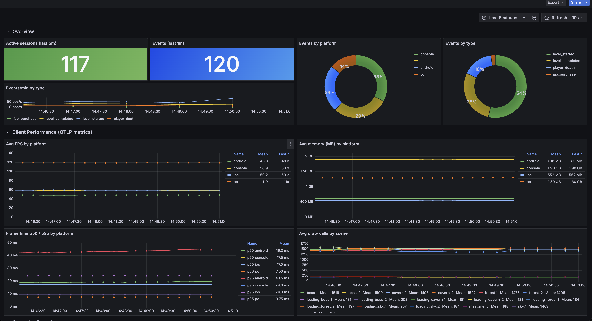
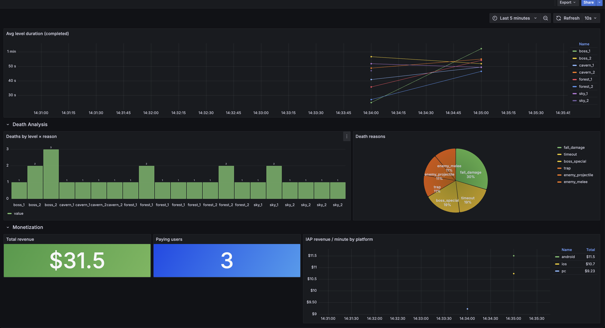

# Self-Hosted Game Analytics with GreptimeDB

A reference backend for game studios who self-host their telemetry instead of
sending it to a third-party analytics vendor.

> **What this is:** a fork-and-extend starter kit — ASP.NET Core + the new
> [GreptimeDB .NET Ingester](https://github.com/GreptimeTeam/greptimedb-ingester-dotnet) +
> Grafana — that turns a single GreptimeDB instance into the whole analytics
> backend: player performance metrics, business events, level funnels, death
> heatmaps, monetization.
>
> **What this is *not*:** a drop-in replacement for GameAnalytics / Firebase
> Analytics / UGS Analytics. Those come with hosted dashboards, retention
> cohort UIs, and one-line client SDKs. This demo does not. It is for teams
> that have decided they want to own the pipeline end-to-end.

## When this makes sense

- You already build a custom backend (accounts, matchmaking, economy) and
  want telemetry to live in the same stack instead of paying a second vendor.
- You need data sovereignty, GDPR self-hosting, or cost control at scale.
- You want full SQL on raw events and raw time-series — not pre-baked
  dashboards in a SaaS UI.
- You are on .NET / C# (common for studios that already run Unity on the
  client and ASP.NET on the backend).

If none of those apply, a hosted vendor is cheaper and faster.

## What GreptimeDB gives you here

A typical self-hosted analytics stack ends up as: Kafka + ClickHouse for
events + Prometheus for metrics + Loki for logs + Grafana on top. This demo
collapses the middle three into one GreptimeDB:

- **OTLP metrics** — `game.fps`, `game.frame_time`, `game.memory`,
  `game.draw_calls`, with per-platform / per-device / per-session
  attributes. Queried via PromQL in Grafana.
- **Structured events** — `level_started`, `level_completed`,
  `player_death`, `iap_purchase` ... written through the .NET SDK as one
  `game_events` table. Queried via SQL (MySQL protocol) in Grafana.
- **Room to grow** — the same GreptimeDB instance handles OTLP logs and
  traces too; extending this demo to cover crash logs is additive, not a
  new datastore.

## Dashboard preview





## Architecture

```
┌─────────────────┐        ┌──────────────────────┐
│  Game client    │  HTTP  │  Analytics Server    │
│  (simulator in  │ ─────► │  ASP.NET Core, .NET 8│  gRPC   ┌────────────┐
│   docker; Unity │ /api/  │                      │ ──────► │            │
│   reference .cs │ events │  GreptimeDB .NET SDK │         │ GreptimeDB │
│   in unity-     │        │  TableBuilder → write│         │   v1.0.0   │
│   reference/)   │  OTLP  │                      │         │            │
│                 │ ────────────────────────────────────────│            │
└─────────────────┘ /v1/otlp/v1/metrics                     └─────┬──────┘
                                                                   │
                                                            ┌──────┴──────┐
                                                            │   Grafana   │
                                                            │  dashboard  │
                                                            └─────────────┘
```

**Business events** (`level_*`, `player_death`, `iap_purchase`) flow through
the analytics server so you can add server-side validation, enrichment or
anti-cheat before they hit storage — the .NET SDK writes the `game_events`
table via gRPC.

**Client performance metrics** go straight to GreptimeDB's native OTLP
endpoint. No collector in the middle; GreptimeDB auto-creates the
Prometheus-style tables.

## Why a backend, not a direct-from-Unity SDK?

The GreptimeDB .NET SDK targets `net8.0+` and depends on `Grpc.Net.Client`
and Apache Arrow. Unity's runtime is Mono + .NET Standard 2.1 through
Unity 6.7 (Mono is only being removed in Unity 6.8, 2026H2). The SDK
cannot load inside a Unity build today.

This matches how every commercial game-analytics product is built:
GameAnalytics, Firebase, PlayFab, Unity Gaming Services all have a thin
HTTP client on the game side and do ingestion work server-side. The
`analytics-server/` here is that ingestion service. See
[`unity-reference/TelemetryClient.cs`](unity-reference/TelemetryClient.cs)
for a Unity drop-in client — same shape as a commercial SDK, just open
source and pointing at your own backend.

The client side is intentionally thin and protocol-agnostic: any engine
(Unreal, Godot, custom C++) can POST the same JSON to `/api/events`.

## How to run

```bash
docker compose up --build -d
```

First start takes a minute or two — the .NET images build from source in
multi-stage Dockerfiles.

| Service            | URL                            | Notes                            |
|--------------------|--------------------------------|----------------------------------|
| GreptimeDB HTTP    | http://localhost:4000          | SQL endpoint, OTLP ingest        |
| GreptimeDB gRPC    | localhost:4001                 | used by the .NET SDK             |
| GreptimeDB MySQL   | localhost:4002                 | used by Grafana for events       |
| Analytics server   | http://localhost:8080          | `POST /api/events`, `/healthz`   |
| Grafana            | http://localhost:3000          | anonymous viewer + admin/admin   |

Tune the simulator load:

```bash
SIM_PLAYER_COUNT=200 SIM_TICK_MS=200 docker compose up -d simulator
```

## Verifying end-to-end

```bash
# 1. Events written via the .NET SDK
curl -s 'http://localhost:4000/v1/sql?db=public' \
  --data-urlencode "sql=SELECT event_type, count(*) FROM game_events GROUP BY event_type"

# 2. OTLP metrics ingested
curl -s 'http://localhost:4000/v1/prometheus/api/v1/label/__name__/values' | jq
# expect: game_fps, game_memory, game_draw_calls, game_frame_time_{bucket,count,sum}

# 3. Per-platform FPS via PromQL
curl -s --data-urlencode 'query=avg by (platform) (game_fps)' \
  'http://localhost:4000/v1/prometheus/api/v1/query' | jq

# 4. Dashboard
open http://localhost:3000/d/game-telemetry/game-telemetry
```

## Schema reference

### `game_events` — written via the .NET SDK

| Column          | Kind      | Type                 |
|-----------------|-----------|----------------------|
| `event_type`    | Tag       | String               |
| `platform`      | Tag       | String               |
| `game_version`  | Tag       | String               |
| `player_id`     | Tag       | String               |
| `session_id`    | Tag       | String               |
| `level_id`      | Tag       | String               |
| `duration_ms`   | Field     | Float64              |
| `score`         | Field     | Int64                |
| `gold_delta`    | Field     | Int64                |
| `amount_usd`    | Field     | Float64              |
| `reason`        | Field     | String               |
| `ts`            | Timestamp | TimestampMillisecond |

See [analytics-server/src/Storage/GreptimeEventsWriter.cs](analytics-server/src/Storage/GreptimeEventsWriter.cs)
for the actual `TableBuilder` call — this is the code you would fork to add
your own game-specific event tables.

### OTLP metrics — auto-created by GreptimeDB

| Metric              | Instrument | Notes                                          |
|---------------------|------------|------------------------------------------------|
| `game.fps`          | Gauge      | frames/sec                                     |
| `game.frame_time`   | Histogram  | ms; exposed as `_bucket`, `_count`, `_sum`     |
| `game.memory`       | Gauge      | MB                                             |
| `game.draw_calls`   | Gauge      | per-frame draw-call count                      |

Common attributes: `player_id`, `platform`, `device_model`, `scene_name`,
`game_version`, `session_id`.

## Layout

```
self-hosted-game-analytics/
├── analytics-server/     ASP.NET Core + GreptimeDB.Ingester — ingestion API
├── simulator/            .NET 8 console — virtual-player load generator
├── unity-reference/      Drop-in TelemetryClient.cs for a Unity project
├── grafana_provisioning/ datasources + dashboard JSON
└── docker-compose.yml
```

## Extending

- **Add new events**: add fields to `GameEvent.cs`, extend the `TableBuilder`
  in `GreptimeEventsWriter.cs`, add new panels in the dashboard.
- **Swap the client**: any language can POST to `/api/events`. The Unity
  reference is one concrete example; a Godot / Unreal / web-game client
  works the same way.
- **Add crash logs**: use GreptimeDB's OTLP logs endpoint
  (`/v1/otlp/v1/logs`) — same database, no extra store.
- **Scale out**: the analytics server is stateless and horizontally
  scalable; the .NET SDK supports multi-endpoint load balancing in its
  `0.2.x` line (pin when upgrading from `net8` onwards).

## See also

- [GreptimeDB .NET Ingester](https://github.com/GreptimeTeam/greptimedb-ingester-dotnet)
- [GreptimeDB OTLP ingestion docs](https://docs.greptime.com/user-guide/ingest-data/for-observability/opentelemetry/)
- [unity-reference/README.md](unity-reference/README.md) — integrating the client into a Unity project
