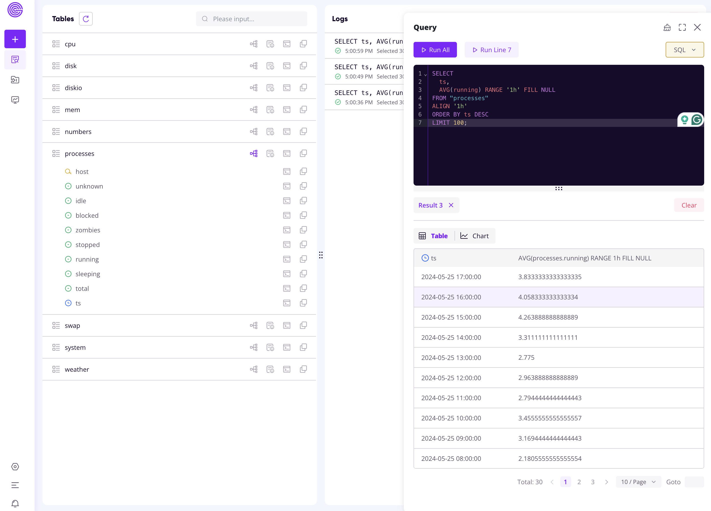
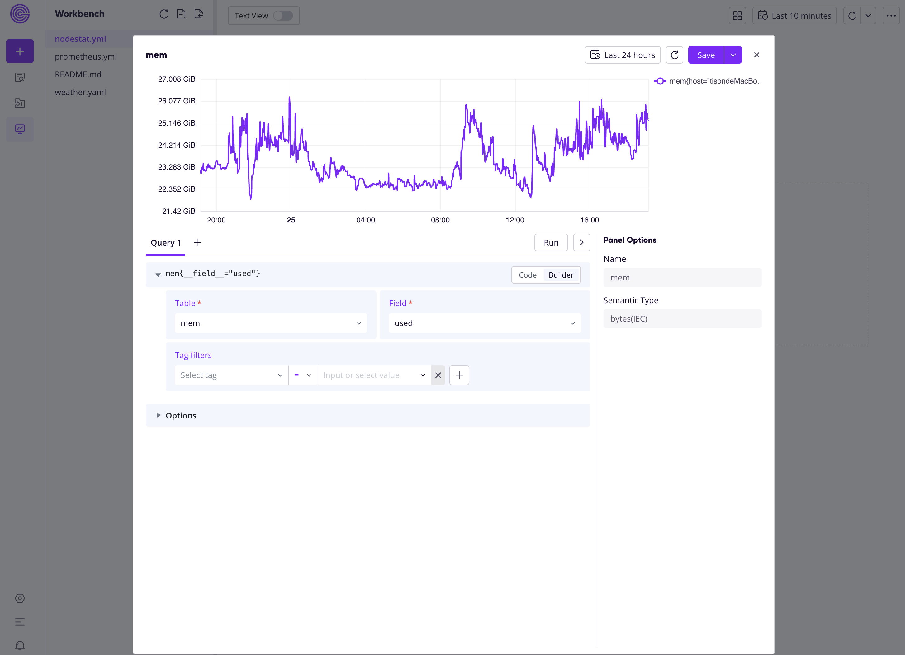

# Use GreptimeDB as a Telegraf Output Destination

## Rationales

As shown in the ["InfluxDB Line Protocol + GreptimeDB + Web UI"](/influxdb-lineprotocol) demo, GreptimeDB can be used as a server acceptings InfluxDB line protocol write calls. This allows us to use GreptimeDB as a Telegraf output destination with its [InfluxDB output plugin](https://github.com/influxdata/telegraf/blob/master/plugins/outputs/influxdb/README.md).

GreptimeDB supports both InfluxDB V1 and V2 ingestion APIs. To simplify the configure, since GreptimeDB doesn't use the "organization" concept that is required in V2, this demo uses the InfluxDB v1.x output plugin.

## Step 1: Set up Greptime service

1. Obtain a free Greptime service from [GreptimeCloud](https://console.greptime.cloud/). 
2. Click the "Connection Information" button and find the connection string.
3. Export the necessary environment variables:

```shell
export GREPTIME_HOST="<host>"
```

```shell
export GREPTIME_DATABASE="<dbname>"
```

```shell
export GREPTIME_USERNAME="<username>"
```

```shell
export GREPTIME_PASSWORD="<password>"
```


## Step 2: Configure and start a Telegraf instance

If you don't have Telegraf installed, head to its [Install](https://docs.influxdata.com/telegraf/v1/install/) page for a guidance. For example, you can install Telegraf with Homebrew by:

```shell
brew install telegraf
```

You can generate a config file by:

```shell
telegraf --sample-config > telegraf.conf
```

Then, you should modify the `[[outputs.influxdb]]` section to configure GreptimeDB's connection info:

```toml
[[outputs.influxdb]]
urls = ["https://${GREPTIME_HOST}/v1/influxdb/"]
database = "${GREPTIME_DATABASE}"
username = "${GREPTIME_USERNAME}"
password = "${GREPTIME_PASSWORD}"
skip_database_creation = true
```

Now you're configured. Choose any [input plugin](https://docs.influxdata.com/telegraf/v1/plugins/) to start collecting statistics.

A sample completed config can be found at [telegraf.conf](telegraf.conf). It configures the GreptimeDB service as if it's an InfluxDB V1 server, and configures default host input statistics (CPUs, processes, memories, disks, etc.).

Let's start the telegraf instance with this config:

```shell
# cd /path/to/telegraf-ingestion/
telegraf --config telegraf.conf
```

## Step 3: Query input statistics

You can make sample queries from the Web Dashboard:




You can also build charts from the statstics for visualization:


