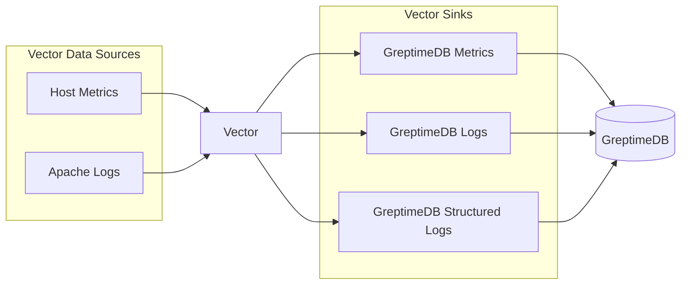

# GreptimeDB Vector Ingestion Demo

This demo shows how to ingest log and metrics data to GreptimeDB via Vector.

[Vector](https://vector.dev) is an observability data pipeline.

## How to run this demo

Ensure you have `git`, `docker`, and `docker-compose` installed. Docker Compose version 2.24 or higher is required. To run this demo:

```shell
git clone https://github.com/GreptimeTeam/demo-scene.git
cd demo-scene/vector-ingestion
docker compose up
```

By default, this example writes data into a GreptimeDB instance within the docker compose.

You can access GreptimeDB using `mysql` client. Just run `mysql -h 127.0.0.1 -P 4002` to connect to the database and use SQL query like `SHOW TABLES` as a start.

```
mysql -h 127.0.0.1 -P 4002
Welcome to the MySQL monitor.  Commands end with ; or \g.
Your MySQL connection id is 8
Server version: 8.4.2 Greptime

Copyright (c) 2000, 2024, Oracle and/or its affiliates.

Oracle and/or its affiliates. Other names may be trademarks of their
respective owners.

Type 'help;' or '\h' for help. Type '\c' to clear the current input
statement.

mysql> show tables;
+-------------------------------------+
| Tables                              |
+-------------------------------------+
| demo_logs                           |
| demo_structured_logs                |
| host_cpu_seconds_total              |
| host_load1                          |
| host_load15                         |
| host_load5                          |
| host_logical_cpus                   |
| host_memory_active_bytes            |
| host_memory_available_bytes         |
| host_memory_buffers_bytes           |
| host_memory_cached_bytes            |
| host_memory_free_bytes              |
| host_memory_shared_bytes            |
| host_memory_swap_free_bytes         |
| host_memory_swap_total_bytes        |
| host_memory_swap_used_bytes         |
| host_memory_swapped_in_bytes_total  |
| host_memory_swapped_out_bytes_total |
| host_memory_total_bytes             |
| host_memory_used_bytes              |
| host_physical_cpus                  |
| numbers                             |
+-------------------------------------+
22 rows in set (0.03 sec)

mysql> select * from demo_logs limit 10;
+-----------+-------------------------------------------------------------------------------------------------------------+---------+-------------+--------------------------------+----------------------------+
| host      | message                                                                                                     | service | source_type | timestamp                      | greptime_timestamp         |
+-----------+-------------------------------------------------------------------------------------------------------------+---------+-------------+--------------------------------+----------------------------+
| localhost | 240.51.83.174 - shaneIxD [06/Nov/2024:09:16:51 +0000] "OPTION /secret-info/open-sesame HTTP/1.1" 304 32496  | vector  | demo_logs   | 2024-11-06T09:16:51.431755762Z | 2024-11-06 09:16:51.453518 |
| localhost | 133.69.143.136 - devankoshal [06/Nov/2024:09:16:50 +0000] "DELETE /apps/deploy HTTP/2.0" 300 15043          | vector  | demo_logs   | 2024-11-06T09:16:50.431762222Z | 2024-11-06 09:16:51.453518 |
| localhost | 248.27.251.166 - shaneIxD [06/Nov/2024:09:16:53 +0000] "DELETE /apps/deploy HTTP/1.1" 302 2208              | vector  | demo_logs   | 2024-11-06T09:16:53.432145448Z | 2024-11-06 09:16:53.435233 |
| localhost | 50.53.10.80 - b0rnc0nfused [06/Nov/2024:09:16:52 +0000] "POST /secret-info/open-sesame HTTP/2.0" 200 36312  | vector  | demo_logs   | 2024-11-06T09:16:52.432110911Z | 2024-11-06 09:16:53.435233 |
| localhost | 14.76.39.141 - CrucifiX [06/Nov/2024:09:16:55 +0000] "HEAD /booper/bopper/mooper/mopper HTTP/1.1" 501 37728 | vector  | demo_logs   | 2024-11-06T09:16:55.431874945Z | 2024-11-06 09:16:55.435782 |
| localhost | 149.32.252.142 - Scarface [06/Nov/2024:09:16:54 +0000] "OPTION /secret-info/open-sesame HTTP/1.1" 400 47732 | vector  | demo_logs   | 2024-11-06T09:16:54.432293077Z | 2024-11-06 09:16:55.435782 |
| localhost | 69.186.52.227 - Scarface [06/Nov/2024:09:16:57 +0000] "GET /this/endpoint/prints/money HTTP/2.0" 304 22480  | vector  | demo_logs   | 2024-11-06T09:16:57.432022936Z | 2024-11-06 09:16:57.435289 |
| localhost | 77.98.82.198 - shaneIxD [06/Nov/2024:09:16:56 +0000] "OPTION /controller/setup HTTP/2.0" 304 28171          | vector  | demo_logs   | 2024-11-06T09:16:56.431549026Z | 2024-11-06 09:16:57.435289 |
| localhost | 194.187.234.10 - AmbientTech [06/Nov/2024:09:16:59 +0000] "GET /do-not-access/needs-work HTTP/1.0" 302 4013 | vector  | demo_logs   | 2024-11-06T09:16:59.431588897Z | 2024-11-06 09:16:59.436308 |
| localhost | 162.99.100.168 - shaneIxD [06/Nov/2024:09:16:58 +0000] "DELETE /controller/setup HTTP/2.0" 550 28013        | vector  | demo_logs   | 2024-11-06T09:16:58.431627166Z | 2024-11-06 09:16:59.436308 |
+-----------+-------------------------------------------------------------------------------------------------------------+---------+-------------+--------------------------------+----------------------------+
10 rows in set (0.02 sec)

mysql> select * from demo_structured_logs limit 10;
+-----------------+-------------+--------------+-------------+-----------------------------------+--------------+---------------+---------------------+
| ip_address      | http_method | http_version | status_code | request_path                      | user         | response_size | request_time        |
+-----------------+-------------+--------------+-------------+-----------------------------------+--------------+---------------+---------------------+
| 10.38.32.241    | OPTION      | 1.1          |         550 | /observability/metrics/production | benefritz    |         34764 | 2024-11-06 09:17:49 |
| 100.207.11.134  | HEAD        | 2.0          |         403 | /apps/deploy                      | BryanHorsey  |         45840 | 2024-11-06 09:17:28 |
| 102.205.214.6   | GET         | 1.0          |         300 | /wp-admin                         | CrucifiX     |          1546 | 2024-11-06 09:17:40 |
| 103.187.179.136 | POST        | 2.0          |         401 | /apps/deploy                      | ahmadajmi    |         49171 | 2024-11-06 09:18:36 |
| 11.218.141.194  | PATCH       | 2.0          |         403 | /user/booperbot124                | b0rnc0nfused |          8001 | 2024-11-06 09:18:50 |
| 114.114.186.132 | POST        | 1.1          |         304 | /wp-admin                         | shaneIxD     |         39731 | 2024-11-06 09:18:04 |
| 119.88.70.103   | GET         | 1.0          |         307 | /wp-admin                         | CrucifiX     |         14333 | 2024-11-06 09:17:51 |
| 12.65.107.156   | OPTION      | 2.0          |         500 | /user/booperbot124                | shaneIxD     |         35444 | 2024-11-06 09:17:14 |
| 122.173.13.156  | PUT         | 1.0          |         503 | /controller/setup                 | b0rnc0nfused |          19266 | 2024-11-06 09:19:00 |
| 127.119.164.82  | OPTION      | 1.0          |         410 | /observability/metrics/production | devankoshal  |         28647 | 2024-11-06 09:18:51 |
+-----------------+-------------+--------------+-------------+-----------------------------------+--------------+---------------+---------------------+
10 rows in set (0.02 sec)

mysql> select * from host_memory_free_bytes limit 10;
+----------------------------+-----------+----------+------------+
| ts                         | collector | host     | val        |
+----------------------------+-----------+----------+------------+
| 2024-11-06 09:18:30.164000 | memory    | power-pc | 2330532000 |
| 2024-11-06 09:18:35.165000 | memory    | power-pc | 2332808000 |
| 2024-11-06 09:18:40.165000 | memory    | power-pc | 2345416000 |
| 2024-11-06 09:18:47.478000 | memory    | power-pc | 2353456000 |
| 2024-11-06 09:18:52.479000 | memory    | power-pc | 2341448000 |
| 2024-11-06 09:18:57.479000 | memory    | power-pc | 2339684000 |
+----------------------------+-----------+----------+------------+
6 rows in set (0.01 sec)
```

You can also open your browser at http://localhost:4000/dashboard for the Web UI.

## Run in GreptimeCloud

By default, this example writes data into a GreptimeDB instance within the docker compose. It's also possible to write to your own GreptimeCloud instance by creating a `greptime.env` file from our sample `greptime.env.sample` and providing your host, dbname and authentication information. Then use `docker compose down` and `docker compose up` to recreate the compose cluster and apply new settings.

## How it works

The topology is:



Vector ingests:
- **Host Metrics**: CPU, load, and memory metrics from the host system
- **Apache Logs**: Simulated Apache access logs in common log format

Vector transforms and writes data to GreptimeDB via:
- **Metrics**: gRPC protocol to the metrics endpoint
- **Logs**: HTTP protocol to the log endpoint using the `greptime_identity` pipeline
- **Structured Logs**: HTTP protocol to the log endpoint using the `apache_common_pipeline` pipeline

The `apache_common_pipeline` defined in `pipeline.yaml` parses Apache common log format and extracts fields like IP address, HTTP method, request path, and status code.
