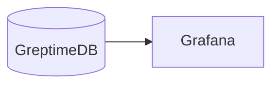

# Wide events, OpenTelemetry with GreptimeDB

This docker-compose file demos how single-source truth, observability
2.0 will work with GreptimeDB.

The demo uses OpenTelemetry SDKs to instrument a Django application
and sends observability data to GreptimeDB. Here we use Otel Trace
SDKs because it's well instrumented. However, in Observability 2.0, we
treat the spans as events and don't require it to be in trace or log
format.

## How to run this demo

Ensure you have `git`, `docker`, `docker-compose` and `mysql` client
installed. Docker Compose version 2.24 or higher is required. To run this
demo:

```shell
git clone https://github.com/GreptimeTeam/demo-scene.git
cd demo-scene/wide-events-django
docker compose up
```

You can access GreptimeDB using `mysql` client. Just run `mysql -h 127.0.0.1 -P
4002` to connect to the database and use SQL query like `SHOW TABLES` as a
start.

```
mysql -h 127.0.0.1 -P 4002
Welcome to the MySQL monitor.  Commands end with ; or \g.
Your MySQL connection id is 8
Server version: 8.4.2 Greptime

Copyright (c) 2000, 2024, Oracle and/or its affiliates.

Oracle is a registered trademark of Oracle Corporation and/or its
affiliates. Other names may be trademarks of their respective
owners.

Type 'help;' or '\h' for help. Type '\c' to clear the current input statement.

mysql> show tables;
TODO
```

## How it works

The topology is illustrated in this diagram.


